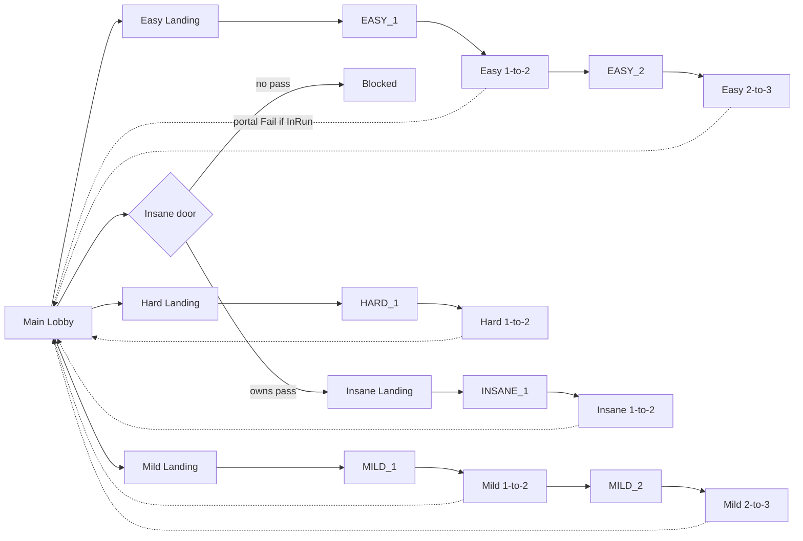
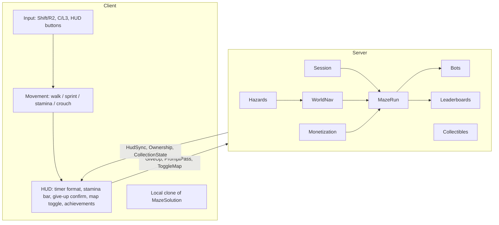
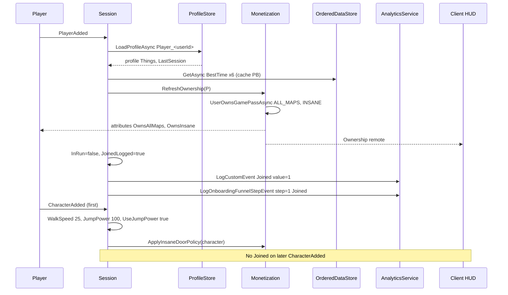
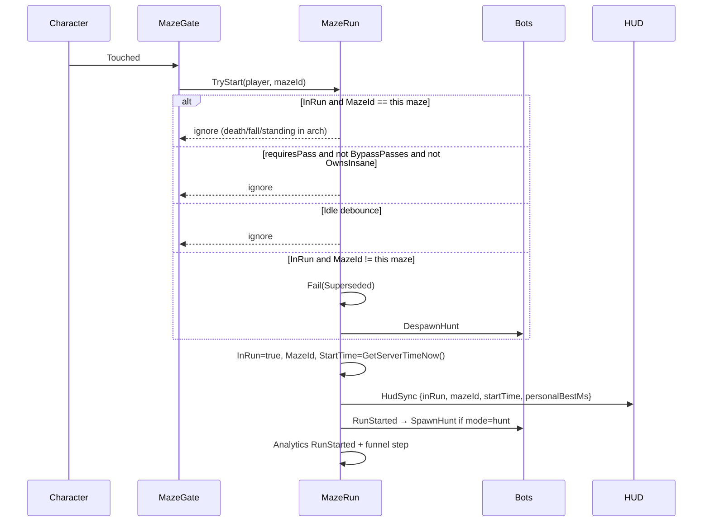
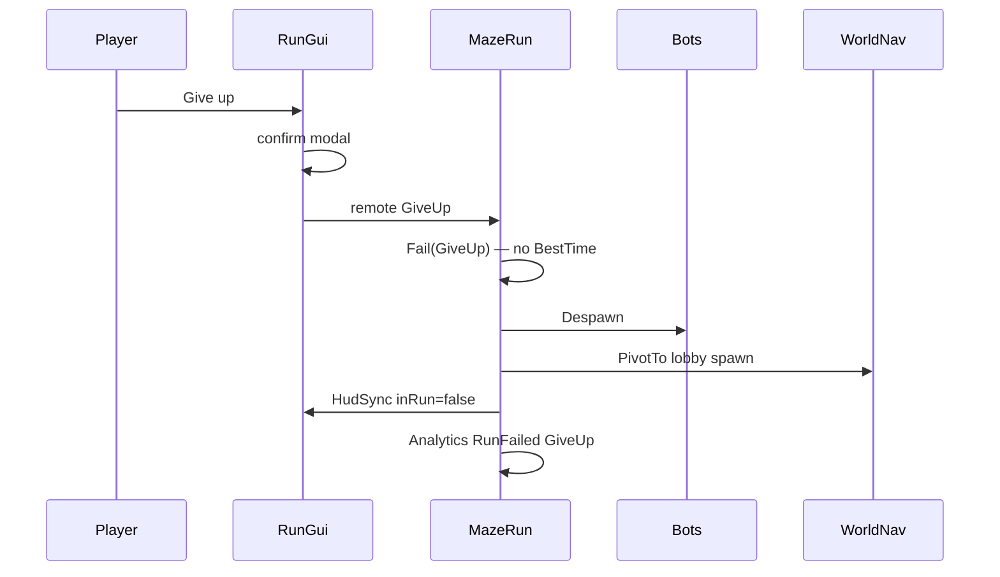

# Maze Runner Rebuild — Game Design, Architecture, and Roadmap

| Field | Value |
|---|---|
| **Author** | Grok (design-doc-writer) |
| **Date** | 2026-08-31 |
| **Status** | In progress — PRs 1–8 done; next PR 9 Insane blockout |
| **Place** | Unpublished `placeId` 135988241030750, universe 10764621894 (not a patch of live `16171071941`) |
| **Product spec** | [`GAME_DESIGN.md`](/Users/renatoalmeida/Dev/roblox_maze/GAME_DESIGN.md) — locked |
| **Live inventory** | [`GAME_LOGIC.md`](/Users/renatoalmeida/Dev/roblox_maze/GAME_LOGIC.md) — constraints and anti-patterns only |

This document restates the locked product, specifies how we build it (Rojo Luau + unpublished place geometry + ProfileStore), and sequences the work as independently shippable PRs. It does not invent gameplay. JetPack is out of MVP.

**In the repo now:** `default.project.json` (`servePort` **34873**), baker (`Bake("EASY_1"|"EASY_2"|"MILD_1"|"MILD_2"|"HARD_1")`), Session / MazeRun / WorldNav, KillBeam Hazards, client Movement / HUD. Vendored `Packages/ProfileStore.luau`. Geometry (lobby, connectors, baked boards) lives in the unpublished place, not git. Disabled `ServerScriptService.DevLog` is place-native version notes. The Studio plugin needs `rojo serve` running or it reports “server not running”. 21 Days keeps `localhost:34872`.

---

## Overview

Maze Runner is a shared-world obby: one static place, six baked mazes, no matchmaking, no lives, no currency. A player walks from a central lobby into a difficulty, crosses a gate (one run starts), races the clock through learnable hazards, and either **Completes** (badge + best time) or **Fails** (give-up / lobby portal / leave — no save). Death and falling off the map are **not** Fail: they dump the player at **that maze’s entrance** with the timer still running.

The live place (`16171071941`) already ships this fantasy, but its scripts are duplicated, mis-tagged, and wrong on the run contract (death leaves `InMaze` and the HUD running; Insane uses a shared `CanCollide` door; per-maze waypoint passes; JetPack coupled to Insane; Easy/Insane have no fall volumes). The rebuild is a **new unpublished place** with ten named modules in this git repo, synced via **Rojo**. Player data uses **ProfileStore** (not ProfileService). Maze geometry is baked in Studio and is **not** in git. Two SKUs (All Maps + Insane). First playable is baker + Easy 1 + the run machine (PRs 1–3).

---

## Background & Motivation

### Current state (live place)

`GAME_LOGIC.md` is the inventory. Load-bearing fantasy to keep: physical hub → maze → connector landing; six maze identities; enter starts a timer; exit (alive) awards a badge and best time; Hard hunters; world collectibles; lobby time boards; sprint.

Load-bearing bugs **not** to copy:

| Live behavior | Why it is wrong for the rebuild |
|---|---|
| Death respawns at main `SpawnLocation`; `InMaze` stays true; timer HUD keeps running | Spec: death → **this maze’s entrance**, timer continues, hunters reset, HUD stays because the run is still live — not because we forgot to clear it |
| Dual `MazeExit` handlers (CollectionService + child `Exit Maze` on EASY_1 / MILD_1 / MILD_2) | One exit path, health-checked |
| Dual Jailbreaker (tag awards badge; misspelled `JairbreakerScript` also fires `MazeCompleted`) | Secret badge does **not** complete the run |
| `GamePassCheckpoint.CanCollide` is a shared part | One owner opens Insane for everyone |
| Slide eject **and** collision barrier | Spec: pick one per-player door, not both |
| Four HunterBots on Hard 1 | Spec: **two** |
| Per-maze waypoint gamepasses | Spec: one **All Maps** pass |
| `IncrementStats` 10 s per-player debounce | Drops legitimate pickups |
| Analytics `Joined` on every `CharacterAdded` | Once per session |
| `CharacterUseJumpPower = false`; crouch restores JumpPower 50; sprint R2 condition inverted | WalkSpeed 25, JumpPower 100, `UseJumpPower = true` always; hold C; Shift **or** R2 |
| Easy 1 / Easy 2 / Insane have no fall volumes | Every maze including Easy and Insane |
| Pixel-matrix `MazeGenerator` scripts | Not ported; baker is recursive backtracker |
| d20 faces 1–3 explode and destroy the die | 1–3 random teleport inside the maze; never kills |

### Why a new place

Patching the live tree means inheriting dual scripts, leftover `Mechs` / `Tokens` / `Breadcrumbs`, a broken pumpkin split, and `VERTICAL_1` naming. A clean place lets maze IDs, attributes, remotes, and datastores match the spec (`INSANE_1`, `InRun`, two SKUs) without a migration of scripts. Geometry is re-baked or re-authored; we do not file-copy the live `Workspace.Mazes`.

---

## Goals & Non-Goals

### Goals (MVP acceptance — `GAME_DESIGN.md` §14)

1. Shared lobby with signs to Easy / Mild / Hard / Insane.
2. Enter Easy 1 (baked 6×6×2 crate maze): live timer + PB; die to a beam; appear at **that maze’s entrance** with the timer still running; finish → badge + board time.
3. Give up to lobby: run does **not** save.
4. Easy 2 → Mild 1 → Mild 2 → Hard 1 through connector rooms; each is its own run.
5. Fall off any maze (including Easy and Insane) → that maze’s entrance.
6. Hard 1: **two** hunters, reset on death, vanish on complete / give-up.
7. d20 on Mild/Hard: faces 1–3 scramble inside the maze; no death; timer continues.
8. Secret on Mild/Hard/Insane → extra badge **without** completing.
9. Insane blocked until owned; completable **on foot**.
10. All Maps: toggle solution overlay for the maze the player is in.
11. World collectibles persist and show in Achievements.
12. Top-10 times per maze + top collectors on lobby boards.
13. Sprint with visible stamina bar; crouch by holding C.

### Non-goals (MVP)

- JetPack, accessory zone, boost-on-equip (post-MVP; pass vs bundle undecided and **out of this doc’s decisions**).
- Breadcrumbs / Star / fake developer products / `ProcessReceipt`.
- Tutorial state machine (Easy 1 **is** the tutorial).
- d20 explosion / random kill.
- Dual exit scripts, dual jailbreaker, pumpkin inventory, TopbarPlus shop.
- Shared `CanCollide` Insane barrier + slide eject.
- Runtime procedural mazes; lives; coins; matchmaking; seasons-as-a-mode; a second place.
- Per-maze waypoint gamepasses.
- BGM / `RandomMusicPlayer` (not in the ten modules; not in the game).
- Migrating live ProfileService / OrderedDataStore rows into the new stores.

---

## Game Design (product restatement)

Locked from `GAME_DESIGN.md`. No new mechanics.

### Fantasy

An obby-style maze runner in **one shared place**. Players spawn in a central lobby, walk to a difficulty (no menu), enter a maze, and try to reach the exit fast. Completing a maze awards a badge, records a best time, and dumps them in a connector landing. No matchmaking, rounds, lives, or currency. Mazes are **baked geometry**, never generated at runtime.

Audience: casual Roblox obby / light speedrun. Easy 1 is the tutorial.

### Design principles

1. One run, one outcome: Enter / Fail / Complete. No third state.
2. Physical world stays. Walking to Easy / Mild / Hard / Insane is the UX.
3. Lethal hazards are learnable. RNG may scramble position; it may not kill.
4. Pay for access or information, not for the game working. MVP: All Maps + Insane door.
5. Data-driven mazes: same run machine + a config table per maze.
6. Easy is the tutorial. No separate tutorial state machine.
7. Bake at edit time, play as static geometry.

### Run contract

A player has **at most one run**.

| Field | Type | Meaning |
|---|---|---|
| `InRun` | bool | Sole occupancy flag. **Only `MazeRun` writes this.** |
| `MazeId` | `EASY_1` … `INSANE_1` | Which maze the run is on |
| `StartTime` | number | `workspace:GetServerTimeNow()` at gate |

Timer elapsed = `now − StartTime`. Server owns it. Client only displays, format `HH:MM:SS:mmm`. HUD on while `InRun`; hide on Complete or Fail.

| Event | Result |
|---|---|
| Cross gate of maze A while Idle | **Start** A. |
| Cross gate of maze A while `InRun` and `MazeId == A` | **Ignore.** Death, fall, and standing in the arch must not Fail or reset `StartTime`. |
| Cross gate of maze B while `InRun` on A (`A ≠ B`) | Fail A, then Start B. |
| Exit plate of A, alive, `MazeId == A` | **Complete** |
| Exit plate, dead or wrong maze | Ignore |
| Death | **Not Fail.** Respawn at **this maze’s EntrancePad** (inside the maze, past the gate). Timer keeps going. Hunters reset. |
| Fall out of bounds | Teleport to this maze’s EntrancePad. Timer keeps going. Hunters do **not** reset. |
| Lobby / Give-up portal | If `InRun`, **Fail** (no BestTime). **Always** teleport to lobby, including Idle / post-Complete. |
| Leave the game | **Fail**. |

Complete writes BestTime only if faster than stored (or none stored). Fail never writes BestTime.

Analytics (once each, correctly):

- `Joined` — first spawn of the **session**, not every respawn.
- `RunStarted` / `RunFailed` / `RunCompleted`.

### World layout

One static place.

- **Main lobby** — only enabled `SpawnLocation`. Signs toward Easy / Mild / Hard / Insane. Shop (All Maps + Insane). Collector + time boards. Collectible spawn pads in the world, **not** inside maze corridors if they would break a race.
- **Difficulty landings** — Easy, Mild, Hard, Insane. Insane landing is behind the paid door.
- **Connector landings** — rest rooms *between runs*, not mid-run checkpoints:
  - Easy 1 → Easy 1-to-2 → Easy 2 → Easy 2-to-3 (dead end / lobby portal)
  - Mild 1 → Mild 1-to-2 → Mild 2 → Mild 2-to-3
  - Hard 1 → Hard 1-to-2
  - Insane 1 → Insane 1-to-2
- **Every landing has a return-to-lobby portal.** Using it during a run Fails that run.
- **Insane gate:** collision groups (option **A**). Door is non-colliding **only for owners**. Not a shared `CanCollide` part. Not a slide that boots people to lobby *and* a barrier. Not a per-player local clone.
- **Fall volumes:** every maze, including Easy and Insane, has an **out-of-bounds void catch** — an under-floor slab plus optional side skirts **outside** the perimeter. It must **not overlap** `Board*` floors/walls, EntrancePad, Exit, or the connector. It sits **above** `Workspace.FallenPartsDestroyHeight` so it fires before the engine kill plane. Touch `PivotTo`s the player to **that maze’s EntrancePad** (standable pad inside the maze, past the gate, + small Y offset). Idle / post-Complete wanderers who fall also land on that EntrancePad (kinder than voiding to lobby). Standing on a floor cell must **not** fire FallVolume.



### Six mazes

Six identities. Completing Easy 1 is a full run; Easy 2 is a new run. Six badges, six time boards.

| ID | Role | Board | Hazards | Bots | Secret |
|---|---|---|---|---|---|
| `EASY_1` | Tutorial. Sprint, beams, death-at-entrance | Two stacked 6×6 crate boards (baker preset) | Toggling kill beams | none | no |
| `EASY_2` | Same difficulty, longer | 6×6 (baker) | Timed fire pads | none | no |
| `MILD_1` | First real pressure | 12×12 walls (baker) | Beams, damage pads, d20 | 2 patrol | yes |
| `MILD_2` | Moving / two-board | Two 12×12 + safe elevators (baker) | Always-on lasers, drones, d20 | 2 patrol + 2 drones | yes |
| `HARD_1` | Chase | 12×12 (baker) | Hunters, d20 | 2 hunters | yes |
| `INSANE_1` | Paid vertical climb | Hand-authored vertical (baker optional) | Geometry; optional beams | none | yes |

Per-maze config is a **row** of identity and policy, not a unique script and **not a spawn list**. Placement and per-part numbers live on tagged instances (see Architecture).

```
id, displayName
badgeId
requiresPass?          -- only INSANE_1
hunters: { mode: none|hunt, count }   -- hunt only; patrol/drones are world fixtures
hazards: [ type, ... ]                -- boot checklist of expected tags, not clones
dice?: { randomPads[4..8] PadIds, luckyPad PadId }
secret?: { badgeId }                  -- part is the tagged Secret; does NOT complete the run
```

Gate, exit, EntrancePad, FallVolume, and lobby portals are found by CollectionService tag + `MazeId`. They are not string paths in this table.

**Secrets.** Mild / Hard / Insane each have one hidden touch part. Awards a secret badge **once**. Does not set Complete, does not stop the timer, does not despawn hunters.

**d20 (Mild 1, Mild 2, Hard 1).** One die per maze. Touch → wait until it settles → read top face. **Never kills. Never completes the maze.** Run stays active.

| Face | Result |
|---|---|
| **1, 2, 3** | Teleport to a **random pad in this maze** from an authored list (4–8 pads: entrance, dead-ends, side rooms). Never lobby, never another maze, never the exit plate |
| **18, 19, 20** | Lucky teleport to a named pad (shortcut / overlook). Not onto the exit trigger |
| **4–17** | Nothing. Short cooldown, can roll again |

After a **teleporting** roll, lock the die **for that player’s run** so it cannot be farmed. Do not destroy the shared world die (that would grief other runners).

**Elevators (Mild 2).** Prismatic (or equivalent) ping-pong platforms. **Safe.** No damage trap on the platform (live elevators dealt 100 — do not copy).

**Bots.** Lifetimes are **not** the same.

- **Patrol** (Mild): persistent world NPCs, authored in the place, walk authored waypoints. Contact = **instant kill** (default health 100 / damage 100). Spawn once at boot. **Never** despawn on someone else’s Complete/Fail/death.
- **Drone** (Mild 2): persistent world NPCs, authored in the place (count = 2). Periodically fire a `ProjectileRing` at a tagged Target. Contact / ring hit = instant kill. Same lifetime as patrol — not cloned per runner.
- **Hunt** (Hard): **2 per run-player**, retarget that player about once per second. Contact = instant kill. Spawn on **that player’s** RunStarted, despawn on **that player’s** Complete/Fail, reset on **that player’s** death. Other runners’ hunters are independent.

Live spawned **four** hunters and destroyed them on character despawn without continuing the run at the entrance. Rebuild: **two** per Hard 1 run, reset (despawn + respawn at pads) on death, because the run continues. Do not copy live’s pre-placed BattleBot `NPC` scripts onto the hunter template.

### Movement

| | Value |
|---|---|
| WalkSpeed | 25 |
| JumpPower | 100 |
| UseJumpPower | **true** (always, including on every `CharacterAdded`) |
| Sprint | Hold Left Shift **or** gamepad ButtonR2. +10 WalkSpeed, cap 35 (25+10) |
| Stamina | 100. Drain 10/s while sprinting. Regen 10/s when not. Exhausted at 0; sprint again after > 60 |
| Stamina HUD | Visible bar while sprinting or recovering (not full) |
| Crouch | **Hold C** or left-stick click (ButtonL3). **Overrides sprint** while held: WalkSpeed 16 (25−9), JumpPower 0. No HUD button. Release restores JumpPower **100** and WalkSpeed 25, or 35 if Shift/R2 is still held and stamina allows. |
| JetPack | **Not in MVP** |

Stamina drains **only while actually sprinting** (WalkSpeed 35). Crouch-override does not drain; regen applies. Exhausted (0) blocks sprint until stamina > 60.

Live anti-patterns: `StarterPlayer.CharacterUseJumpPower = false`; sprint R2 written as `~= LeftShift or == ButtonR2`; crouch was a HUD toggle that restored JumpPower 50. None of that ships.

### Timer, stats, leaderboards

- Timer: server elapsed; client formats `HH:MM:SS:mmm`. Show personal best if one exists.
- Profile (ProfileStore): `{ Things = {}, LastSession = "N/A", BestTimes = {} }`.
- OrderedDataStore for times and collector counts. Times stored as integer milliseconds.
- Scopes: `EASY_1`, `EASY_2`, `MILD_1`, `MILD_2`, `HARD_1`, `INSANE_1`, `COLLECTOR`. **Not** `VERTICAL_1`. **No** `PUMPKIN`.
- Keys: `GetOrderedDataStore("MazeRunnerStats", scope)` with key `tostring(userId)` so `GetSortedAsync` does not mix boards. Live place used composite `scope/stat/userId` in one list — do not copy.
- Maze boards ascending (fastest first). Collector descending.
- World boards: six time panels + one Collector panel, top 10, refresh ~60–70 s. No pumpkin board.
- No per-player debounce that drops legitimate pickups or time saves.

### Collectibles

One catalog. One profile map `Things[id] = count`. One collector score.

MVP catalog: **8** items (reuse the non-seasonal toys: Jiffies, bird, octopus, etc.). Seasonal skins are later catalog rows with a `season` field, not a second datastore.

Spawn loop:

1. Clear current world Things.
2. Wait cooldown (20 s live / 2 s Studio).
3. Spawn **6** clones onto **unused** pads. Pad pick: weighted by `Rank` (default 1; weight = Rank / sum of unused Ranks). Catalog id per spawn: **uniform with replacement** from the 8-row catalog (duplicates allowed; live rarities are dropped).
4. Live **60 s** (5 s Studio).
5. Repeat.

Pickup: touch the **tagged `Thing` part** (not the model) → server reads `ThingId` attribute → destroys ancestor model → increment `Things[ThingId]` and `COLLECTOR` by 1. No 10-second debounce.

Achievements panel: always available from lobby HUD. Grey uncollected; check + count when collected. Use **display names**, not internal keys.

### Monetization (MVP)

| Product | Unlocks |
|---|---|
| **All Maps** | Toggle solution overlay for **whatever maze the player is in** |
| **Insane** | Insane door |

No per-maze map passes. No breadcrumbs. No `ProcessReceipt` (no developer products in MVP).

**Maps:** if owned, HUD button while `InRun` toggles a **client-local** clone of the baker’s solution model for `run.mazeId`. Click again destroys it.

**Insane:** ownership checked on the door **and** on `MazeRun` start/complete. Shop prompt in the lobby.

**Post-MVP (not specified beyond this):** JetPack accessory, legal only in lobby + Insane, either its own pass or folded into Insane. Insane must remain completable without it.

### HUD and input

| Element | When |
|---|---|
| Timer + PB | `InRun` |
| Stamina bar | sprinting or recovering |
| Give up | `InRun` (confirms → lobby, Fail) |
| Map toggle | `InRun` and owns All Maps |
| Achievements | always |
| Crouch | **no button** (hold C / L3) |
| JetPack / accessories | **not in MVP** |
| Teleporting | only for cross-place (none required in MVP) |

---

## Proposed Design

### Place and tooling (Rojo + unpublished place)

**Luau lives in this git repo and syncs into Studio with Rojo.** Geometry (lobby, connectors, baked boards, Insane climb, mesh templates) lives in an unpublished Studio place. Rojo sets `$ignoreUnknownInstances` on Workspace-adjacent services so `rojo serve` does not delete baked mazes.

| In git (`src/`, `Packages/`) | In the unpublished place |
|---|---|
| All ModuleScripts / Scripts / LocalScripts | Lobby, landings, connectors, signs |
| `MazeConfig`, `Constants`, remotes folder | Baker **output** (`Board*`, FallVolume, EntrancePad) |
| Maze baker **source** (`src/server/Baker`, RunBake Disabled) | Wall / container MeshPart templates |
| Vendored **ProfileStore** (`Packages/ProfileStore.luau`) | Dressed hazards, bots, d20, spawn pads, leaderboard panels |

Dev loop:

1. `cd` this repo and run `rojo serve` (listens on **34873**).
2. Unpublished place open in Studio → Rojo plugin → connect **`localhost:34873`** (not 34872).

Wally is **not** installed here; do not run `wally install` yet. `wally.toml` records `lm-loleris/profilestore@1.0.3` for later.

```
src/shared/          → ReplicatedStorage.Shared
src/server/          → ServerScriptService (Main, Session, MazeRun, …)
Packages/            → ServerScriptService.Packages (ProfileStore)
src/client/          → StarterPlayer.StarterPlayerScripts
```

New place settings (do these once in Studio, PR 1):

| Setting | Value |
|---|---|
| `StarterPlayer.CharacterUseJumpPower` | **true** |
| `StarterPlayer.CharacterWalkSpeed` | 25 (Movement still reapplies on spawn) |
| `StarterPlayer.CharacterJumpPower` | 100 |
| `Players.RespawnTime` | 0.5–1 s (death must feel like a maze reset, not a lobby trip) |
| `Workspace.StreamingEnabled` | **false** for MVP (one static place; streaming makes hunter pathfinding and fall volumes flaky). Revisit if Insane part count forces it. |
| `Workspace.FallenPartsDestroyHeight` | Well **below** every maze `FallVolume` (author FallVolumes above this plane so the volume fires first) |
| `Workspace:GetAttribute("BypassPasses")` | **true** on the unpublished place until PR 14; `TryStart` skips `requiresPass` while true |
| `Workspace:GetAttribute("UseStudioDataStores")` | **false** by default; when true in Studio, ODS and ProfileStore use real Studio datastores (otherwise ProfileStore `.Mock`) |
| Only one `SpawnLocation.Enabled` | Main lobby |

Do **not** enable a second place. Do **not** copy live `ServerScriptService` scripts.

### Server vs client responsibilities



| Concern | Server | Client |
|---|---|---|
| `InRun` / `MazeId` / `StartTime` | **Owns.** Attributes on the Player. | Reads for HUD |
| Gate / exit / fall / portal / die / secret / pickup | Touched handlers | None (no client “I finished”) |
| BestTime write, badge award, collector increment | **Owns.** `UpdateAsync` / `AwardBadge` | Display only |
| Gamepass ownership | `UserOwnsGamePassAsync` + `PromptGamePassPurchaseFinished` | Button visibility from replicated attributes |
| Solution overlay | Validates ownership for the HUD flag | Local clone / destroy |
| Insane door | Ownership cache; rejects `INSANE_1` start/complete if not owned. Collision groups `InsaneDoor` / `InsaneOwners` (server apply) | Same groups on local character + `DescendantAdded` (CollisionGroup is not replicated) |
| Hunt bots | Per-run-player spawn / pathfind / contact kill / despawn / death-reset | None |
| Patrol + drones | Boot-time persistent NPCs; never despawned on run events | None |
| Sprint / crouch / stamina | Sets base WalkSpeed / JumpPower / `UseJumpPower` on spawn | Applies sprint/crouch modifiers locally (standard Roblox character control) |
| Timer display | `StartTime` attribute = `GetServerTimeNow()` | `now - StartTime`, format string |
| Analytics | `AnalyticsService` custom events | None |

**Never trust the client for:** complete, fail, elapsed time, pickup, pass ownership, badge, hunter kill, die face result, secret.

Sprint/crouch being client-side is accepted: it does not write run outcome. A speed hack is a generic Roblox exploit, not a MazeRun API.

### The ten modules

If it is not in this table, it is not in the game. Each is a ModuleScript plus a thin init Script that `require`s it on boot.

| Module | Runtime | Job | Does **not** |
|---|---|---|---|
| **Session** | Server | `PlayerAdded` / `PlayerRemoving`; ProfileStore `StartSessionAsync` / `EndSession`; set default attributes; `Joined` analytics once; re-apply movement defaults + Insane door policy on `CharacterAdded`; if `InRun` on respawn, call `WorldNav.TeleportToEntrance` | Flip `InRun`; write ODS BestTime |
| **MazeRun** | Server | Gate/exit; the **only** writer of `InRun` / `MazeId` / `StartTime`; Fail/Complete; badge; best time; **hunt** spawn/despawn hooks; `HudSync`; secret-badge touch (does not Complete) | Teleport implementation; hazard damage; patrol/drone lifetime |
| **WorldNav** | Server | Lobby portals (**always** `PivotTo` lobby; Fail only if `InRun`); fall volumes (`PivotTo` EntrancePad, run continues if any); death-to-entrance (called from Session on respawn); Give-up teleport **called by MazeRun** after Fail; d20 `TeleportToPad(mazeId, padId)` | Flip `InRun` itself — it **asks** MazeRun to Fail; listen to `RunFailed` for teleports |
| **Hazards** | Server | Data-driven: `KillBeam`, `DamagePad`, `TimedFire`, `ProjectileRing`, `MovingPlatform` (safe), `Dice`. One handler per **type**, bound via CollectionService tags + **instance attributes** | Per-part unique Scripts; spawning from `MazeConfig.hazards` |
| **Bots** | Server | **Hunt:** 2 per run-player, spawn/despawn/reset on that player’s run events. **Patrol + drone:** persistent, authored, init at boot. Instant-kill contact. Dummy templates, **no** child NPC scripts | Four hunters; leftover `NPC1` / `SolveMaze`; despawning world patrols |
| **Collectibles** | Server + client UI | Spawn table (6 / 60 s / 8 catalog); pickup; collection UI | Pumpkin store; 10 s debounce |
| **Monetization** | Server + client shop | All Maps + Insane; prompts; ownership attributes; Insane door policy; map-toggle permission | Per-maze passes; `ProcessReceipt`; JetPack |
| **Leaderboards** | Server | OrderedDataStore adapter; SurfaceGui top 10; 60–70 s refresh | Pumpkin board; per-player save debounce |
| **Movement** | Client (+ server spawn defaults) | Walk 25, sprint +10 cap 35, stamina 100/10/10, exhaust 0 resume >60, hold C/L3 crouch **overrides sprint** (16 / JumpPower 0), release restores JumpPower 100 | HUD crouch button; JetPack |
| **Maze baker** | Edit-time (`src/server/Baker`, RunBake Disabled) | Command-bar `Bake`. Easy 1 first. Not required by Session or MazeRun at runtime | Turrets, fire pads, bots, d20, secrets, lobby |

Boot order (server init Script `ServerScriptService.Main`). **Require is optional** so PRs 1–13 boot without Monetization / Collectibles / Leaderboards / Hazards / Bots:

```lua
-- ServerScriptService.Main (Script)
local function init(name)
  local mod = script.Parent:FindFirstChild(name)
  if mod then
    require(mod).Init()
  end
end

init("Session")
init("Monetization") -- no-op until PR 14
init("MazeRun")
init("WorldNav")
init("Hazards")
init("Bots")
init("Collectibles")
init("Leaderboards")
-- Maze baker is NOT required here.
```

Avoid circular requires with a tiny signal hub:

```lua
-- ServerScriptService.GameEvents (ModuleScript)
-- BindableEvents created once; modules connect, never require each other for flow.
-- RunStarted, RunFailed, RunCompleted, PlayerDiedInRun, PassOwnershipChanged
```

`MazeRun` fires `RunStarted` / `RunFailed` / `RunCompleted`. `Bots` (hunt only) and `Hazards` (dice unlock) listen. WorldNav **does not** listen to `RunFailed` for teleports.

Portal `Touched`: `if player:GetAttribute("InRun") then MazeRun.Fail(player, "LobbyPortal") end` then **always** `WorldNav.TeleportToLobby(player)`. Give-up remote: `MazeRun.Fail` then **one** `WorldNav.TeleportToLobby` from the MazeRun handler. Leave: Fail only (no teleport).

### Suggested instance tree

**Target** tree for the finished MVP. **Rojo already syncs** `Shared`, `Remotes`, SSS modules (`Main`, `Session`, `MazeRun`, `WorldNav`, `Hazards` KillBeam, `Baker`, stubs for later slices), `Packages.ProfileStore`, and client Movement / HUD. **In the place now (PRs 1–8):** lobby + Easy/Mild/Hard landings, connectors, `EASY_1`/`EASY_2`/`MILD_1`/`MILD_2`/`HARD_1` baked mazes, Easy 1 kill beams, unwired Mild/Hard dice/secrets/waypoints/BotSpawns, `BypassPasses`. Still later: Insane climb, remaining hazard types, bots, ODS boards, collectibles, SKUs.

```
Workspace
  SpawnLocation                    -- Enabled = true (only one)
  Lobby
    Main                           -- floor, walls, signs, shop kiosks
    Shop                           -- All Maps + Insane ProximityPrompts (PR 14)
    EasyLanding
    MildLanding                    -- PR 7
    HardLanding                    -- PR 8
    InsaneLanding                  -- PR 9, behind InsaneDoor
    Connectors                     -- filled per maze PR
    InsaneDoor                     -- CollisionGroup InsaneDoor; PR 14
  Mazes
    EASY_1
      Entrance
        MazeGate                   -- thin VERTICAL trigger at the arch (tag MazeGate, attr MazeId)
        EntrancePad                -- standable pad INSIDE the maze, past the gate
      Exit                         -- MazeExit part (tag MazeExit, attr MazeId)
      Arena
      Board1 / Board2              -- baker output only; re-bake deletes these
      Hazards                      -- dressed after bake (PR 5)
      FallVolume                   -- void shell: under-floor slab + outer skirts; no overlap with Board*/pads/connector
    EASY_2 / MILD_1 / MILD_2 / HARD_1 / INSANE_1   -- same skeleton, later PRs
    -- no shared Workspace.Mazes.Solution folder; overlay is client-local
  ThingSpawnPads                   -- PR 13; 12–16 pads; not in maze corridors
  Leaderboard                      -- PR 12

ReplicatedStorage
  Remotes                          -- Folder; see catalog below
  Shared
    MazeConfig
    Constants
    ThingCatalog                   -- PR 13
  MazeSolution                     -- baker stamps per mazeId at WORLD CFrames
    EASY_1                         -- Model.WorldPivot = maze origin

ServerStorage
  Templates
    Walls
      ShippingContainer            -- Easy; clone, never Unique-Union
      Wall                         -- Mild/Hard
    Bots                           -- dummy models, NO child NPC/Pathfinding scripts
      PatrolBot                    -- PR 11
      HunterBot                    -- PR 11
      Drone                        -- PR 11
    Hazards                        -- PR 5 / PR 10
    Things                         -- PR 13; 8 catalog models

ServerScriptService
  Main                             -- optional init() from PR 1
  GameEvents
  Session / MazeRun / WorldNav / …
  Baker                            -- Rojo: src/server/Baker; RunBake Disabled
  Packages
    ProfileStore                   -- vendored Packages/ProfileStore.luau

StarterPlayer
  StarterPlayerScripts             -- Movement/HUD/Input: PR 4
  StarterCharacterScripts          -- empty (Movement is a player script)

StarterGui                         -- TimerGui/StaminaGui/RunGui: PR 4 (Map hidden until PR 14)
                                   -- AchievementsGui: PR 13
```

CollectionService tags (one tag per concern — **never tag a model twice** like live d20). `Thing` is on the **touch part**, not the model, with `ThingId`.

| Tag | Attributes | Handler |
|---|---|---|
| `MazeGate` | `MazeId: string` | MazeRun |
| `MazeExit` | `MazeId: string` | MazeRun |
| `EntrancePad` | `MazeId: string` | WorldNav (`TeleportToEntrance`) |
| `FallVolume` | `MazeId: string` | WorldNav |
| `LobbyPortal` | — | WorldNav |
| `KillBeam` | `Damage`, `Period`, `StartOn` | Hazards |
| `DamagePad` | `Damage` | Hazards |
| `TimedFire` | `Windup`, `Active`, `Damage`, `Hits`, `HitGap` | Hazards |
| `ProjectileRing` | `Period`, `Tween`, `Damage`, `Target` (ObjectValue or name) | Hazards / Drone |
| `MovingPlatform` | `Amplitude`, `Period` | Hazards |
| `Dice` | `MazeId: string` | Hazards |
| `Secret` | `MazeId: string`, `BadgeId: number` | MazeRun |
| `ThingSpawnPad` | `Rank: number?` (default 1) | Collectibles |
| `Thing` | `ThingId: string` on the **touch part** | Collectibles |
| `InsaneDoor` | — | Monetization |
| `PatrolWaypoint` | `MazeId`, `BotIndex`, `Order` | Bots |
| `BotSpawn` | `MazeId`, `Slot` | Bots (hunt pads) |
| `DicePad` | `MazeId`, `PadId`, `Kind: random\|lucky` | WorldNav.TeleportToPad |

### MazeConfig (shared data)

`ReplicatedStorage.Shared.MazeConfig` is identity + policy. **Tagged instances are authoritative** for placement and per-part numbers (`Damage`, `Period`, `Hits`, pad CFrames). `MazeConfig.hazards` is a **boot checklist**: on `Hazards.Init`, warn if a listed type has zero tags under `Workspace.Mazes.<id>`. It is **not** a spawn list — dressing clones templates into the maze folder and tags them.

`WorldNav.TeleportToPad(player, mazeId, padId)` finds the `DicePad` whose `MazeId` and `PadId` match. `config.dice.randomPads` / `luckyPad` are those `PadId` strings.

```lua
-- ReplicatedStorage.Shared.Constants
return {
  WalkSpeed = 25,
  SprintBonus = 10,
  SprintCap = 35,                 -- 25+10
  JumpPower = 100,
  CrouchSpeedDelta = -9,          -- crouch WalkSpeed = 16; crouch overrides sprint
  StaminaMax = 100,
  StaminaDrainPerSecond = 10,     -- only while actually sprinting
  StaminaRegenPerSecond = 10,
  StaminaResumeThreshold = 60,
  GateDebounceSeconds = 1.5,      -- Idle→Running Touched spam only
  EntrancePadYOffset = 3,
  DiceSettleSpeed = 0.4,
  DiceSettleTimeout = 8,          -- seconds; then treat as faces 4–17
  DiceNothingCooldown = 2,
  DiceImpulse = Vector3.new(0, 12, 8), -- server ApplyImpulse if not already resolving
  HunterRetargetSeconds = 1,
  MaxHuntPairs = 8,               -- cap: later Hard 1 runners get no extra bots (not shared world hunters)
  LeaderboardRefreshSeconds = 65,
  CollectibleCount = 6,
  CollectibleLiveSeconds = 60,    -- Studio: 5
  CollectibleCooldownSeconds = 20,-- Studio: 2
  BotContactDamage = 100,
}

-- ReplicatedStorage.Shared.MazeConfig (shape; IDs filled when created)
return {
  EASY_1 = {
    id = "EASY_1",
    displayName = "Easy 1",
    badgeId = 0,                  -- new universe: fill a new badge ID in PR 14; never reuse live IDs
    requiresPass = false,
    hunters = { mode = "none", count = 0 },
    hazards = { "KillBeam" }, -- checklist only; count/period live on tagged parts
    dice = nil,
    secret = nil,
  },
  EASY_2 = {
    id = "EASY_2",
    displayName = "Easy 2",
    badgeId = 0,
    requiresPass = false,
    hunters = { mode = "none", count = 0 },
    hazards = { "TimedFire" }, -- Hits/HitGap live on the tagged parts
  },
  MILD_1 = {
    id = "MILD_1",
    displayName = "Mild 1",
    badgeId = 0,
    hunters = { mode = "none", count = 0 }, -- patrols are world fixtures, not this table
    hazards = { "KillBeam", "DamagePad", "Dice" },
    dice = {
      randomPads = { "pad1", "pad2", "pad3", "pad4" }, -- DicePad.PadId values, 4–8
      luckyPad = "overlook",
    },
    secret = { badgeId = 0 },
  },
  MILD_2 = {
    id = "MILD_2",
    displayName = "Mild 2",
    hunters = { mode = "none", count = 0 },
    hazards = { "KillBeam", "MovingPlatform", "Dice" }, -- lasers: part Period=0 StartOn=true
    -- drones: 2 authored persistent bots, not hunters.drones; they emit ProjectileRing
    dice = { randomPads = { --[[ PadIds ]] }, luckyPad = "overlook" },
    secret = { badgeId = 0 },
  },
  HARD_1 = {
    id = "HARD_1",
    displayName = "Hard 1",
    hunters = { mode = "hunt", count = 2 }, -- the only maze that uses hunt lifecycle
    hazards = { "Dice" },
    dice = { randomPads = { --[[ PadIds ]] }, luckyPad = "overlook" },
    secret = { badgeId = 0 },
  },
  INSANE_1 = {
    id = "INSANE_1",
    displayName = "Insane 1",
    requiresPass = true, -- enforced only when BypassPasses is false (PR 14)
    hunters = { mode = "none", count = 0 },
    hazards = {},
    secret = { badgeId = 0 },
  },
}
```

Boot validation (`Hazards.Init` / `Bots.Init`): for each maze, `warn` if a checklist type has zero tags, if hunt `count > 0` but `BotSpawn` tags < count, or if `dice.randomPads` names a `PadId` with no matching `DicePad`. Do not spawn substitutes. `badgeId = 0` / pass id `0`: skip `AwardBadge` / `UserOwnsGamePassAsync` (pcall-guarded no-op).

Entrance / exit / EntrancePad / FallVolume / lobby portals are **instances** found by tag + `MazeId`, not stringly-typed `Workspace.Teleport Target Locations` names (live anti-pattern: a parallel folder of teleports, including the typo `TeleporTrigger`).

### Run state machine

```mermaid
stateDiagram-v2
  [*] --> Idle: PlayerAdded InRun=false
  Idle --> Running: MazeGate Touched (MazeRun.TryStart)
  Running --> Idle: Complete (exit alive, MazeId match)
  Running --> Idle: Fail (give-up / lobby portal / leave / superseded by a *different* maze gate)
  Running --> Running: Death (respawn at EntrancePad past the gate, hunters reset)
  Running --> Running: FallVolume (PivotTo EntrancePad; hunters stay)
  Running --> Running: Same-maze MazeGate (ignore)
  Running --> Running: d20 teleport (pads in this maze)
  Running --> Running: Secret touch (badge only)
```



Player attributes (server writes, replicate for HUD):

| Attribute | Type | Writer |
|---|---|---|
| `InRun` | boolean | **MazeRun only** |
| `MazeId` | string | MazeRun (`""` when idle) |
| `StartTime` | number | MazeRun (`GetServerTimeNow()`, `0` when idle) |
| `OwnsAllMaps` | boolean | Monetization |
| `OwnsInsane` | boolean | Monetization |

No `ReplicatedStorage.Timer/<PlayerName>` StringValues. No 0.5 s coroutine writing `StopTime`. Client HUD:

```lua
local elapsed = workspace:GetServerTimeNow() - player:GetAttribute("StartTime")
```

`MazeRun.TryStart(player, mazeId)`:

1. If `mazeId` unknown or `MazeConfig[mazeId].enabled == false`: ignore.
2. If `InRun` and `MazeId == mazeId`: **ignore** (death respawn, fall, standing in the arch, Touched spam). Do **not** Fail, do **not** reset `StartTime`.
3. Debounce: if not `InRun` and last *successful* start was < `GateDebounceSeconds` ago: ignore (Idle→Running Touched collapse only).
4. If `requiresPass` and not `Workspace:GetAttribute("BypassPasses")` and not server ownership cache `OwnsInsane`: ignore. (`BypassPasses` is true until PR 14 so Insane is playable on foot during world PRs.)
5. If `InRun` and `MazeId ~= mazeId`: `Fail(player, "Superseded")` first.
6. Set `InRun=true`, `MazeId`, `StartTime = GetServerTimeNow()`.
7. Read in-memory PB cache `bestTimes[mazeId]` (filled at join and on faster Complete).
8. `HudSync` `{ inRun=true, mazeId, startTime, personalBestMs }`.
9. Fire `GameEvents.RunStarted`.
10. Analytics: custom event + funnel step (see Observability).
11. Unlock this player’s die for the new run.

`MazeRun.Complete(player, mazeId)`:

1. Reject unless `InRun` and `MazeId == mazeId` and `Humanoid.Health > 0`.
2. If `requiresPass` and not `BypassPasses` and not `OwnsInsane`: ignore (cannot badge a stolen Insane run).
3. `elapsedMs = math.round((GetServerTimeNow() - StartTime) * 1000)`.
4. Clear run attributes.
5. If `badgeId ~= 0`: `pcall(BadgeService.AwardBadge, …)` (ignore already-owned / Studio).
6. `isNewBest = Leaderboards.TrySaveBestTime(...)`. On success **and** faster: `SessionState[player].bestTimes[mazeId] = elapsedMs`.
7. Fire `RunCompleted`; `HudSync` hide **including** `personalBestMs` so the next start is not stale; analytics.

`MazeRun.Fail(player, reason)`:

1. No-op if not `InRun` (Idle lobby-portal use must not depend on this).
2. Clear run attributes. **No** BestTime write. **No** badge.
3. Fire `RunFailed`; `HudSync` hide; analytics with `reason` (`GiveUp` | `LobbyPortal` | `Leave` | `Superseded`).
4. Teleport: **only** the Give-up remote handler calls `WorldNav.TeleportToLobby` after Fail. Portal `Touched` teleports itself. Leave does not teleport.

Death does **not** call Fail. Session on `Humanoid.Died` (if `InRun`) fires `PlayerDiedInRun`; Bots despawn **that player’s hunt pair only**. On the subsequent `CharacterAdded`, Session sees `InRun` still true → `WorldNav.TeleportToEntrance` (EntrancePad CFrame + `EntrancePadYOffset`, then `character:PivotTo`) + Movement defaults + hunt respawn + Insane door policy. The EntrancePad is **past** the vertical `MazeGate`, so `TryStart` step 2 ignores the gate.

Leave: `PlayerRemoving` → `Fail(player, "Leave")` then profile `Release`.

### RemoteEvent / RemoteFunction / BindableEvent catalog

#### BindableEvents — `ServerScriptService.GameEvents` (server-only)

| Name | Fired by | Payload | Listeners |
|---|---|---|---|
| `RunStarted` | MazeRun | `player, mazeId, startTime` | Bots.SpawnHunt (hunt mazes only), Hazards.OnRunStarted (unlock die) |
| `RunFailed` | MazeRun | `player, mazeId, reason` | Bots.DespawnHunt, Hazards.OnRunEnded. **Not** WorldNav |
| `RunCompleted` | MazeRun | `player, mazeId, elapsedMs, isNewBest` | Bots.DespawnHunt, Hazards.OnRunEnded |
| `PlayerDiedInRun` | Session | `player, mazeId` | Bots.DespawnHunt (reset on next CharacterAdded) |
| `PassOwnershipChanged` | Monetization | `player, passKey, owned` | Insane door policy (server + client); HUD via `Ownership` remote |

WorldNav does **not** listen to `RunFailed`. Portal `Touched` Fails-if-InRun then always teleports. Give-up remote Fails then MazeRun calls `TeleportToLobby` once.

#### Remotes — `ReplicatedStorage.Remotes`

Create on the server at boot (never trust client-created remotes). Folder layout matches module names.

| Path | Kind | Direction | Payload | Auth |
|---|---|---|---|---|
| `MazeRun/HudSync` | RemoteEvent | S → C | `{ inRun: bool, mazeId: string?, startTime: number?, personalBestMs: number? }` | Server only |
| `MazeRun/GiveUp` | RemoteEvent | C → S | `{ }` (empty; client already confirmed) | No-op unless `InRun`; `Fail("GiveUp")` then **one** `WorldNav.TeleportToLobby` |
| `Monetization/PromptPass` | RemoteEvent | C → S | `{ passKey: "ALL_MAPS" \| "INSANE" }` | Ignore unknown keys; `PromptGamePassPurchase` |
| `Monetization/Ownership` | RemoteEvent | S → C | `{ allMaps: bool, insane: bool }` | Server only (also mirrored as attributes) |
| `Monetization/ToggleMap` | RemoteFunction | C → S | `()` → `{ ok: bool, mazeId: string? }` | `ok` only if `OwnsAllMaps` and `InRun`; client then local-clones `ReplicatedStorage.MazeSolution[mazeId]` |
| `Collectibles/State` | RemoteEvent | S → C | `{ things: { [id]: number } }` | On join + after each pickup |
| `Collectibles/PickedUp` | RemoteEvent | S → C | `{ id, displayName, count }` | Toast / panel refresh |

No `PurchaseDevProduct`. No `AttachAccessoryRemote`. No `SpawnMechRemote`. No client-fired `MazeCompleted`.

Give-up confirm is **local UI**. Only the confirmed fire hits the server.

Map overlay: `ToggleMap` is a permission check, not a server clone into `Workspace.Mazes.Solution` (that would be **shared** — live anti-pattern). HUD rules:

1. First click: `InvokeServer`. If `ok` **and** no local clone, `clone = ReplicatedStorage.MazeSolution[mazeId]:Clone()` then `clone:PivotTo(source:GetPivot())` (baker stamps **world CFrames**; the model’s `WorldPivot` is the maze origin) and parent under a **client-only** folder e.g. `Workspace.LocalMap` created by the LocalScript.
2. **Second click destroys locally** — no remote.
3. `HudSync` with `inRun=false` or a different `mazeId` destroys the local clone.

### Data stores

New store names so Studio and the unpublished place cannot clobber live `BotJamMazePlayerProfile` / `BotJamMazeRunnerStatsStore`.

| Store | Kind | Name | Key | Template / value |
|---|---|---|---|---|
| Profile | ProfileStore | `MazeRunnerPlayer` | `tostring(userId)` | `{ Things = {}, LastSession = "N/A", BestTimes = {} }` |
| Stats | OrderedDataStore | `MazeRunnerStats` **per Roblox scope** | `tostring(userId)` | integer ms or count |

**ProfileStore** ([MadStudioRoblox/ProfileStore](https://github.com/MadStudioRoblox/ProfileStore)). Successor to ProfileService. **Not for leaderboards.** Module under `ServerScriptService.Packages.ProfileStore`. Session:

```lua
local ProfileStore = require(game.ServerScriptService.Packages.ProfileStore)
local PlayerStore = ProfileStore.New("MazeRunnerPlayer", {
  Things = {},
  LastSession = "N/A",
  BestTimes = {}, -- [mazeId] = ms; HUD replica
})
if RunService:IsStudio() and workspace:GetAttribute("UseStudioDataStores") ~= true then
  PlayerStore = PlayerStore.Mock -- never write live keys from Studio by default
end
local profile = PlayerStore:StartSessionAsync(tostring(player.UserId), {
  Cancel = function()
    return player.Parent ~= Players
  end,
})
if profile == nil then
  player:Kick("Could not load data — please rejoin")
  return
end
profile:AddUserId(player.UserId)
profile:Reconcile()
profile.OnSessionEnd:Connect(function()
  if player.Parent == Players then
    player:Kick("Profile session ended — please rejoin")
  end
end)
-- PlayerRemoving: profile.Data.LastSession = DateTime.now():ToIsoDate(); profile:EndSession()
```

Mutate `profile.Data` in place. Auto-save ~300s. `Things[id] = count` is the inventory. `BestTimes[mazeId]` is a HUD replica; **OrderedDataStore remains leaderboard truth**. On a faster ODS `UpdateAsync`, also write `profile.Data.BestTimes[mazeId]` so the next run’s HUD is not stale.

**OrderedDataStore.** `GetSortedAsync` has **no key-prefix filter**. One unscoped store would interleave every maze’s times with collector counts and cannot be sorted both ascending and descending. Roblox **scope** is the second argument to `GetOrderedDataStore`, not a string in the key.

```lua
local function statsStore(scope: string)
  return DataStoreService:GetOrderedDataStore("MazeRunnerStats", scope)
end
-- scopes: EASY_1, EASY_2, MILD_1, MILD_2, HARD_1, INSANE_1, COLLECTOR
-- key: tostring(player.UserId)   -- parse entry.key with tonumber for GetNameFromUserIdAsync
```

- Times: integer milliseconds. Collector: integer count.
- Maze boards: `statsStore(mazeId):GetSortedAsync(true, 10)` — **ascending**, fastest first.
- Collector: `statsStore("COLLECTOR"):GetSortedAsync(false, 10)` — **descending**.
- Board refresh: **one loop**, seven `GetSortedAsync` calls, then for each `entry` resolve `userId = tonumber(entry.key)` → `Players:GetNameFromUserIdAsync` + thumbnail (`rbxthumb://type=AvatarHeadShot&id=<userId>&w=48&h=48`). `pcall` every call; skip a row on failure.

Best-time write (no 10 s debounce):

```lua
local wroteNewBest = false
local ok, stored = pcall(function()
  return statsStore(mazeId):UpdateAsync(tostring(userId), function(old)
    if old == nil or elapsedMs < old then
      wroteNewBest = true
      return elapsedMs
    end
    return old -- tie or slower: not a new best
  end)
end)
local isNewBest = ok and wroteNewBest
if isNewBest then
  SessionState[player].bestTimes[mazeId] = elapsedMs
end
-- Do NOT use `stored == elapsedMs`: a tie returns old == elapsedMs and would
-- fire isNewBest / analytics on a non-faster time. Spec: write only if faster.
```

Collector increment:

```lua
pcall(function()
  statsStore("COLLECTOR"):UpdateAsync(tostring(userId), function(old)
    return (old or 0) + 1
  end)
end)
```

**Studio mock.**

| Store | When mocked |
|---|---|
| ProfileStore | `.Mock` when `IsStudio()` **and** `UseStudioDataStores ~= true` (never write live `Things` by default) |
| OrderedDataStore | In-memory `StatsStore` iff `(IsStudio() and Workspace:GetAttribute("UseStudioDataStores") ~= true) or game.CreatorId == 0` |

Those two rules do not conflict: profiles never hit production from Studio; ODS can opt into Studio datastores for board-layout testing via `UseStudioDataStores`. Guard `GetAsync` / `UpdateAsync` / `AwardBadge` / `UserOwnsGamePassAsync` in `pcall`. If `badgeId == 0` or pass id `== 0`, skip the call.

**No migration** of live `BotJam*` rows. **New universe, all new IDs** — do not reuse live badges or Insane pass `940187199`. No grandfathering. `MazeConfig.badgeId` / `Passes` stay `0` until PR 14 fills Creator Dashboard IDs.

### Maze baker (edit-time, Rojo source)

A **disabled** command script, not a runtime require. Invoke from the Command Bar:

```lua
require(game.ServerScriptService.Baker.MazeBaker).Bake("EASY_1")
```

Re-bake **destroys that maze’s `Board*` folder(s) only**. Entrance, Exit, Arena, Hazards, Bots, FallVolume-if-hand-moved are left alone unless the baker is explicitly restamping FallVolume / gate / exit (flags on the preset).

#### What it stamps

- Floor parts per cell.
- Walls cloned from a template (Easy: shipping-container model; **clone, don’t unique-union**).
- Perimeter.
- Entrance / exit openings.
- Tagged `MazeGate` + `MazeExit` plates (if `stampPlates = true`).
- Fall volume as a **void shell**, not a solid AABB (`CanCollide = false`, `CanTouch = true`, tag `FallVolume`): under-floor slab below walkable cell floors + optional side skirts outside the perimeter. **No overlap** with `Board*` / EntrancePad / Exit / connector. Baker playtest: standing on a floor cell must not fire it.
- Optional Solution overlay: unique-path **centerline** parts, parented to `ReplicatedStorage.MazeSolution.<MAZE_ID>` (replace on re-bake). Stamp each part at **world CFrame** (same as it would have in the maze). Set the model `WorldPivot` to the maze origin. Client clone does `clone:PivotTo(source:GetPivot())` so the overlay lines up. Do **not** bake a model sitting at identity.
- Layer connector: stairs at a cell on the unique path (Easy 1: layer 1 → layer 2).

#### What it does **not** stamp

Turrets, fire pads, bots, d20, secrets, lobby, connectors, leaderboards, collectible pads. Those come from maze config + hand-dress after the bake.

The old `MazeGenerator` / `MazeGenerator Orig` pixel-matrix scripts are **not** ported.

#### Easy 1 preset (first consumer)

| Param | Value |
|---|---|
| `mazeId` | `EASY_1` |
| `seed` | knobbable while iterating; **lock an integer** for the shipped layout |
| `gridWidth` / `gridHeight` | 6 / 6 |
| `layers` | 2 |
| `cellSize` | 24 |
| `wallHeight` | 10.7 |
| `wallTemplate` | `ServerStorage.Templates.Walls.ShippingContainer` |
| `origin` | Easy landing CFrame (preset field, set once in Studio) |
| `entranceCell` | south, layer 1 |
| `exitCell` | north, layer 2 |
| `algorithm` | recursive backtracker (perfect maze) |
| `bakeSolution` | true |
| `layerConnector` | stairs at a cell on the unique path |

Later presets: Easy 2 (6×6, one or two layers); Mild/Hard (12×12, `Wall` template). Insane may stay hand-authored vertical.

#### Algorithm

Recursive backtracker yields a **perfect** maze (unique path between any two cells), which is what the solution overlay needs.

```
for each layer L:
  cells[w][h] = { N=true, E=true, S=true, W=true, visited=false }
  rng = Random.new(seed + L * 997)
  stack = { entranceCell or (0,0) }
  mark visited
  while stack:
    cell = stack.top
    neighbors = unvisited of N/E/S/W
    if none: pop
    else:
      pick rng neighbor
      knock wall both ways
      push neighbor
stamp floors; for every remaining wall, clone wallTemplate at the edge CFrame
carve entrance opening (south, L1) and exit opening (north, L2)
path = BFS from entrance to stairs cell on L1, then stairs to exit on L2
  -- choose stairs cell as the first cell on L1's unique path whose
  -- Manhattan distance to the north edge is maximal among cells with
  -- degree 2, else the midpoint of the unique path
stamp stairs in that cell; punch floor hole on L2
if bakeSolution:
  stamp centerline parts at world CFrames into ReplicatedStorage.MazeSolution.EASY_1
  set that model's WorldPivot = maze origin
AABB = origin + (w*cellSize, layers*wallHeight + headroom, h*cellSize)
-- FallVolume is VOID GEOMETRY, not the AABB itself (an AABB CanTouch part
-- would Touched-yoink anyone walking the boards).
stamp FallVolume as:
  1. under-floor slab: same XZ as the maze, Y from just below cell floors
     down toward (but still above) FallenPartsDestroyHeight
  2. optional four side skirts: thin boxes *outside* the perimeter walls,
     from slab up to wallHeight, so falling off an edge hits a skirt
  -- no overlap with Board* floors/walls, EntrancePad, Exit, or connector
  -- CanCollide false, CanTouch true
  -- playtest: stand on a floor cell → FallVolume must not fire
stamp MazeGate as a thin vertical part in the entrance opening
stamp EntrancePad inside the first cell, past the gate, standable
  -- TeleportToEntrance uses EntrancePad:GetPivot() * CFrame.new(0, EntrancePadYOffset, 0) then PivotTo
```

Seed: `Baker.Presets.EASY_1.seed` is a number attribute on the preset module, edited while iterating. Before ship, lock it and stop changing it (changing seed after dress-up orphans hazard positions).

Footprint: Easy 1 one layer is 6×24 = 144 studs square; two layers stacked with `wallHeight` 10.7 plus stair run. Mild/Hard 12×24 = 288 studs square.

### Insane door (collision groups — chosen)

Live: invisible `GamePassCheckpoint` with **shared** `CanCollide`, plus a slide that `MoveTo`s non-owners to lobby. One owner touching the part opens it for everyone. Spec forbids that pairing. **Chosen: option A (collision groups), not a local clone.** Trade-off vs B is in Alternatives §5.

`BasePart.CollisionGroup` is **not replicated** and characters are client-simulated, so server-only assignment desyncs. Implement the **full** A spec:

- Register **only** `InsaneDoor` and `InsaneOwners` in Studio (Collision groups editor, **edit-time**). Do **not** `RegisterCollisionGroup("Default")` — `Default` is built-in and cannot be registered. Runtime register is expensive on large workspaces; Insane is thousands of parts.
- `PhysicsService:CollisionGroupSetCollidable("InsaneDoor", "InsaneOwners", false)` (and the inverse if the API is not symmetric). `InsaneDoor` still collides with `Default`.
- Door part: `CollisionGroup = "InsaneDoor"`, `CanCollide = true`, anchored, visible. No slide eject. No local clone.
- Apply groups on **server and local client**: on `CharacterAdded` **and** `character.DescendantAdded` (accessories / layered clothing spawn later). If `OwnsInsane`, set every `BasePart` to `InsaneOwners`; else leave `Default`.
- Without the client apply, the owner still collides with the door locally.

`MazeRun.TryStart("INSANE_1")` and `Complete("INSANE_1")` check the **server ownership cache** (not the attribute). The door is UX; the run machine is the lock. Shop ProximityPrompt in `Workspace.Lobby.Shop` fires `PromptPass{ passKey = "INSANE" }`. Pass ID is a **new** gamepass (new universe; not `940187199`).

### Death vs Give-up

| | Death | Fall | Give-up | Lobby portal | Leave |
|---|---|---|---|---|---|
| `InRun` | stays true | stays true | **Fail** | Fail **if** `InRun` | **Fail** |
| Timer | continues | continues | stop, hide HUD | stop if was InRun | stop |
| Character | EntrancePad (past gate) + Y offset, `PivotTo` | same EntrancePad | lobby, **one** teleport from MazeRun | **always** lobby, even if Idle | n/a |
| Hunt bots | reset that player’s pair | **do not** reset | despawn that pair | despawn if Fail | despawn |
| BestTime / badge | no | no | no | no | no |
| Analytics | none | none | `RunFailed` GiveUp | `RunFailed` only if was InRun | `RunFailed` Leave |

`TeleportToEntrance`: look up `EntrancePad` tag + `MazeId`, `cf = pad:GetPivot() * CFrame.new(0, EntrancePadYOffset, 0)`, `character:PivotTo(cf)`. Do **not** use `MoveTo` (spec wording); `PivotTo` needs the Y offset because it will not slide onto the floor.

Fall volumes: `Touched` → `TeleportToEntrance` for **any** character of a player (Idle included — kinder than voiding to lobby). Do not Fail. The catch is **void only** (under-floor slab + outer skirts). It must not overlap walkable `Board*` / EntrancePad / Exit / connector — otherwise a corridor walk or death `PivotTo` would loop-teleport. Author it **above** `FallenPartsDestroyHeight` so the volume wins over the engine kill plane (which would take the death path and reset hunters). Baker/playtest check: standing on a floor cell does not fire FallVolume.

Give-up: client modal → `MazeRun/GiveUp` → `Fail("GiveUp")` → **one** `WorldNav.TeleportToLobby`. Portal does not go through that path.

### Hazards as data, not per-part scripts

Live turrets, pumpkin fires, elevator traps, and drones each carry child Scripts. Rebuild: **zero** hazard Scripts under `Workspace.Mazes`. `Hazards.Init` binds CollectionService `GetInstanceAddedSignal` for each type.

```lua
-- Hazards.KillBeam
-- Tagged part is the trigger. Attributes: Damage, Period, StartOn.
-- If Period > 0: toggle CanTouch / a visual Beam every Period seconds (Easy 1: 3 s, start OFF).
-- On Touched: if humanoid, TakeDamage(Damage). 100 → instant kill at default health.
-- Always-on lasers (Mild 2): Period = 0, StartOn = true.

-- Hazards.TimedFire (Easy 2)
-- Attributes on the tagged part: Windup, Active, Damage, Hits (default 2), HitGap (default 2).
-- Windup visual then enable touch for Active seconds; apply Damage Hits times HitGap apart.

-- Hazards.MovingPlatform (Mild 2)
-- PrismaticConstraint ping-pong. NO touch damage.

-- Hazards.ProjectileRing
-- Used by persistent Drone bots (Mild 2). Target attribute = a part in the maze.
-- Period / Tween / Damage on the drone or a child emitter. Not a MazeConfig spawn row.

-- Hazards.Dice
-- Template MUST contain 20 BaseParts with attribute Face = 1..20. Tag the model once.
-- Server table resolving[mazeId] = true from impulse until face is read (one settle at a time;
-- a second player touching during flight is ignored).
-- On first eligible touch: if not resolving, ApplyImpulse(DiceImpulse) on the assembly.
-- Wait until AssemblyLinearVelocity.Magnitude < DiceSettleSpeed OR DiceSettleTimeout (8s).
-- Timeout → treat as faces 4–17 (cooldown, no teleport). Wedge cannot hang the die forever.
-- Else read Face of the highest-Y face part.
-- 1–3: WorldNav.TeleportToPad(mazeId, random PadId from config.dice.randomPads)
--       then diceLocked[player][mazeId] = true (per-player; do not Destroy the shared die).
-- 18–20: TeleportToPad(mazeId, config.dice.luckyPad), same lock.
-- 4–17: cooldown DiceNothingCooldown, allow re-roll.
-- Never Fail, never Complete, never damage.
```

Dressing Easy 1 after bake: clone 3 `KillBeam` templates into `Workspace.Mazes.EASY_1.Hazards`, tag them, set attributes. No Lua on the clones. Counts and positions do **not** come from `MazeConfig.hazards`.

### Sequence diagrams

#### Join



#### Start run



#### Death (run continues)

```mermaid
sequenceDiagram
  participant Hum as Humanoid
  participant Sess as Session
  participant B as Bots
  participant WN as WorldNav
  participant H as HUD

  Hum->>Sess: Died (InRun true)
  Sess->>B: PlayerDiedInRun → Despawn
  Note over Sess: InRun stays true; no Fail; no HudSync hide
  Sess->>Sess: CharacterAdded
  Sess->>WN: TeleportToEntrance → EntrancePad + Y offset, PivotTo
  Note over WN: pad is past MazeGate so TryStart ignores
  Sess->>Sess: Movement defaults + Insane door policy
  Sess->>B: SpawnHunt (reset at BotSpawn pads)
  Note over H: Timer still visible; elapsed = now - original StartTime
```

#### Complete

```mermaid
sequenceDiagram
  participant Body as Character
  participant Exit as MazeExit
  participant MR as MazeRun
  participant ODS as OrderedDataStore
  participant Badge as BadgeService
  participant B as Bots
  participant H as HUD

  Body->>Exit: Touched
  Exit->>MR: TryComplete(player, mazeId)
  alt not InRun or MazeId mismatch or Health <= 0
    MR-->>Exit: ignore
  else requiresPass and not BypassPasses and not OwnsInsane
    MR-->>Exit: ignore
  else ok
    MR->>MR: elapsedMs; clear InRun
    MR->>Badge: AwardBadge(completion)
    MR->>ODS: UpdateAsync BestTime if faster; cache bestTimes[mazeId]
    MR->>B: RunCompleted → DespawnHunt (patrols/drones stay)
    MR->>H: HudSync inRun=false, personalBestMs
    MR->>MR: Analytics RunCompleted value=elapsedMs
    Note over Body: Player walks physically into connector; no teleport
  end
```

#### Give-up



Lobby portal is **not** the same path: WorldNav `Touched` → `if InRun then Fail("LobbyPortal") end` → **always** `TeleportToLobby`. Idle / post-Complete portal use must work. Do not also teleport from a `RunFailed` listener (Give-up would double-`PivotTo`).

#### d20 roll

```mermaid
sequenceDiagram
  participant Body as Character
  participant Die as Dice
  participant Hz as Hazards
  participant WN as WorldNav
  participant MR as MazeRun

  Body->>Die: Touched
  Die->>Hz: onTouched
  alt not InRun or MazeId mismatch or locked for this player+run or resolving[maze]
    Hz-->>Die: ignore
  else cooldown (faces 4–17 recent)
    Hz-->>Die: ignore
  else
    Hz->>Hz: resolving=true; ApplyImpulse
    Hz->>Hz: wait velocity < settle OR timeout
    alt timeout
      Hz->>Hz: treat as 4–17; resolving=false
    else
      Hz->>Hz: read highest-Y Face 1..20
      alt 1,2,3
        Hz->>WN: TeleportToPad(mazeId, random PadId)
        Hz->>Hz: lock die for this player+run
      else 18,19,20
        Hz->>WN: TeleportToPad(mazeId, lucky PadId)
        Hz->>Hz: lock die for this player+run
      else 4–17
        Hz->>Hz: start nothing-cooldown
      end
    end
    Hz->>Hz: resolving=false
    Note over MR: InRun unchanged; never damage; never Complete
  end
```

#### Collectible pickup

```mermaid
sequenceDiagram
  participant Body as Character
  participant Thing as Thing part
  participant Col as Collectibles
  participant Prof as Profile
  participant ODS as OrderedDataStore
  participant UI as AchievementsGui

  Body->>Thing: Touched
  Thing->>Col: server handler
  alt model already destroyed (double touch)
    Col-->>Thing: ignore
  else
    Col->>Col: read ThingId on touch part; Destroy model
    Col->>Prof: Things[ThingId] += 1
    Col->>ODS: UpdateAsync COLLECTOR Count += 1  -- no 10s debounce
    Col->>UI: State + PickedUp {displayName, count}
  end
```

#### Map toggle

```mermaid
sequenceDiagram
  participant U as Player
  participant HUD as RunGui
  participant Mon as Monetization
  participant RS as ReplicatedStorage.MazeSolution

  U->>HUD: Map button (visible iff InRun and OwnsAllMaps)
  alt local clone already exists
    HUD->>HUD: Destroy local overlay (no remote)
  else
    HUD->>Mon: ToggleMap InvokeServer
    alt not OwnsAllMaps or not InRun
      Mon-->>HUD: { ok=false }
    else
      Mon-->>HUD: { ok=true, mazeId }
      HUD->>RS: Clone MazeSolution[mazeId]
      HUD->>HUD: clone:PivotTo(source:GetPivot()); parent client-only
    end
  end
  Note over HUD: HudSync inRun=false or mazeId change also Destroy
```

#### Insane door

```mermaid
sequenceDiagram
  participant U as Player
  participant Shop as Shop prompt
  participant Mon as Monetization
  participant MPS as MarketplaceService
  participant Door as InsaneDoor
  participant MR as MazeRun

  U->>Shop: Prompt
  Shop->>Mon: PromptPass INSANE
  Mon->>MPS: PromptGamePassPurchase
  MPS-->>Mon: PromptGamePassPurchaseFinished
  Mon->>Mon: OwnsInsane=true; set character parts InsaneOwners (server + client, DescendantAdded)
  U->>Door: walk through (owners only)
  U->>MR: MazeGate INSANE_1
  MR->>MR: requiresPass check OwnsInsane
  Note over MR: Start/Complete still reject if attribute spoofed; server re-reads ownership cache
```

### Observability

`AnalyticsService:LogCustomEvent(player, eventName, value, customFields)` — third argument is a **number** (default 1), not a Lua table. Extra dimensions use at most three `Enum.AnalyticsCustomFieldKeys.CustomField01/02/03` string values. Custom events do **not** appear as a Creator Hub funnel; that is a separate API.

**Custom events** (server only, `pcall`ed):

| Event | When | `value` | CustomField01 | CustomField02 | CustomField03 |
|---|---|---|---|---|---|
| `Joined` | `PlayerAdded` after profile load, **once** | 1 | — | — | — |
| `RunStarted` | `TryStart` success | 1 | `mazeId` | — | — |
| `RunFailed` | `Fail` | 1 | `mazeId` | `reason` | — |
| `RunCompleted` | `Complete` | `elapsedMs` | `mazeId` | `isNewBest` (`"true"`/`"false"`) | — |

```lua
AnalyticsService:LogCustomEvent(player, "RunStarted", 1, {
  [Enum.AnalyticsCustomFieldKeys.CustomField01.Name] = mazeId,
})
AnalyticsService:LogCustomEvent(player, "RunCompleted", elapsedMs, {
  [Enum.AnalyticsCustomFieldKeys.CustomField01.Name] = mazeId,
  [Enum.AnalyticsCustomFieldKeys.CustomField02.Name] = isNewBest and "true" or "false",
})
```

**Onboarding funnel** (`LogOnboardingFunnelStepEvent`) — once per player, Creator Hub onboarding chart:

| Step | Name | When |
|---|---|---|
| 1 | `Joined` | session `Joined` |
| 2 | `FirstRunStarted` | first successful `TryStart` this session |
| 3 | `FirstRunCompleted` | first `Complete` this session |

**Per-run funnel** (`LogFunnelStepEvent`, funnel name `"MazeRun"`, `funnelSessionId = HttpService:GenerateGUID()` at `TryStart`; max 10 funnels / 100 steps on the platform):

| Step | Name | When |
|---|---|---|
| 1 | `Start` | `TryStart` success; store `funnelSessionId` on session state |
| 2 | `Complete` | `Complete` success, same id |

Fail is a **drop** (no step 2). CustomField01 = `mazeId` on both steps. Do not call `LogFunnelStepEvent` with a Lua table as `value`; that API has no value parameter.

**Prints / warns** (prefix `[MazeRunner.<Module>]`):

| Level | Example |
|---|---|
| `print` | Session profile loaded; baker “stamped EASY_1 seed=N boards=2”; run start/complete with mazeId and elapsedMs |
| `warn` | Profile load fail; `UserOwnsGamePassAsync` error; Pathfinding `ComputeAsync` nil for a hunter; ODS `UpdateAsync` fail; baker origin unset; maze config missing `badgeId` at Complete |
| `error` only for boot invariants | Missing `MazeConfig` row; remotes folder absent |

No per-frame prints. Hunter path fail: `warn` throttled to once per 5 s per bot.

Leaderboard refresh: `print` once per cycle with duration ms (catch ODS stalls > 2 s).

---

## API / Interface Changes

Greenfield place: there is no old module API to preserve. The interfaces above **replace** live remotes (`ShowTimerRemote`, `GamePassRemoteFunction`, `PurchaseDevProduct`, `AttachAccessoryRemote`, `MazeCompleted` bindable, `SetupTimer`, `ThingCollected`, `AwardBadge` bindable, `GetStatsFunction` / `SaveStatsFunction` / `GetTop10Function` / `IncrementStats`).

Player-facing IDs:

| Live | Rebuild |
|---|---|
| `InMaze` | `InRun` |
| `VERTICAL_1` | `INSANE_1` |
| Six `WAYPOINTS_*` passes | One `ALL_MAPS` |
| `PASSES.VERTICAL_1` (Insane + JetPack) | `INSANE` (door only) |
| `BotJamMazePlayerProfile` / `BotJamMazeRunnerStatsStore` | `MazeRunnerPlayerProfile` / `MazeRunnerStats` |
| Scope `VERTICAL_1`, `PUMPKIN` | `INSANE_1`; no pumpkin |

`StarterPlayer.CharacterUseJumpPower`: live **false** → rebuild **true**.

---

## Data Model Changes

Greenfield. No live-row migration in MVP.

**Profile template:**

```lua
{
  Things = {},          -- [catalogId] = number
  LastSession = "N/A",  -- string
}
```

**OrderedDataStore:** `GetOrderedDataStore("MazeRunnerStats", scope)` for each of `EASY_1`…`INSANE_1`, `COLLECTOR`. Key = `tostring(userId)`. Integer ms for times; integer counts for collector. Board refresh resolves `tonumber(entry.key)` → display name + thumbnail.

**Catalog (8 items, display names for UI).** Spec locks **8** non-seasonal rows. Live non-pumpkin keys are only seven (`PinkJiffy`, `YellowJiffy`, `BlueJiffy`, `RO01Red`, `OctopusToy`, `Native`, `Bird`). Reuse those seven; add one new non-seasonal placeholder mesh (`Crystal`) rather than pulling a pumpkin or opening a second datastore. Keys never shown in UI.

| Key | Display |
|---|---|
| `PinkJiffy` | Pink Jiffy |
| `YellowJiffy` | Yellow Jiffy |
| `BlueJiffy` | Blue Jiffy |
| `RO01Red` | Red RO-01 |
| `OctopusToy` | Octopus Toy |
| `Native` | Native |
| `Bird` | Blue Bird |
| `Crystal` | Crystal |

**In-memory session cache** (not persisted beyond ProfileStore / ODS):

```lua
SessionState[player] = {
  profile = Profile,
  bestTimes = { EASY_1 = number?, ... },
  diceLocked = { [mazeId] = bool },
  gateDebounceUntil = number,
}
```

---

## Alternatives Considered

### 1. Patch the live place vs new place

| | Patch live 16171071941 | **New place (chosen)** |
|---|---|---|
| Speed | Faster to “see” Easy 1 | Need to rebuild lobby + bake |
| Risk | Dual scripts, shared CanCollide, VERTICAL_1 names leak | Clean contract |
| Data | Accidental writes to live stores | New store names + Studio mock |
| Audience | Instant | Unpublished until swap / overwrite |

Patching would require deleting `MazeGenerator`, breadcrumbs, JetPack, dual exits, and the slide in-situ. Cost exceeds a new place for six mazes we are re-baking anyway.

### 2. Studio-only scripts vs Rojo/git-sync

| | Studio-only | **Rojo hybrid (chosen)** |
|---|---|---|
| Geometry | Native (baker stamps in place) | Stays in the unpublished place; `$ignoreUnknownInstances` |
| Code review | Place file / Team Create | PRs on `src/**/*.luau` |
| Diff | Opaque | Excellent |
| Onboarding | Open Studio | Rojo plugin + `rojo serve` |

**Chosen: Rojo for Luau, Studio for instances.** Mazes are still a poor fit for git (2k+ parts); they are not in `src/`.

### 3. Shared Workspace solution clone vs client-local clone vs ServerStorage stream

Live cloned `ReplicatedStorage.Maze Solution.<ID>` into `Workspace.Mazes.Solution` (everyone sees it). Chosen: **client-local clone** after a server permission check. Exploiters who can read `ReplicatedStorage` can still steal the path (same as live). Gating geometry in ServerStorage and cloning into Workspace is **worse** (shared). True secrecy would mean sending a list of points only to owners; not worth it for an obby overlay.

### 4. `CharacterAutoLoads = false` vs teleport-on-`CharacterAdded`

Disabling auto-load and `LoadCharacter` at the maze entrance avoids a 1-frame lobby flash on death. It is also a common source of “stuck with no character” bugs. Chosen: keep auto-load, `RespawnTime` short, `PivotTo` EntrancePad on `CharacterAdded` if `InRun`. Optional fade in HUD later. Not a product change.

### 5. Insane door: collision groups vs local clone

| | **A. Collision groups (chosen)** | B. Local clone (rejected) |
|---|---|---|
| Spec | Non-colliding only for owners | Same |
| Physics truth | Server groups **not replicated**; character is client-simulated | Barrier exists only on that client — matches who can walk |
| Exploit | Harder if groups actually apply on the client | Delete local clone and walk through |
| Accessories | Need `DescendantAdded` or hats in `Default` still hit the door | Recreate clone on `CharacterAdded` |
| Register | Edit-time `InsaneDoor` + `InsaneOwners` only; never register `Default` | None |
| Lock | `TryStart`/`Complete` ownership cache either way | Same |

**Chosen: A (collision groups).** User decision. Not a local clone, not a slide, not shared `CanCollide`. A without a client apply will desync (`CollisionGroup` is not replicated) — so PR 14 **must** apply groups on server **and** local client, including `DescendantAdded`. The run machine remains the real lock.

### 6. ProfileStore vs ProfileService vs raw DataStores

| | **ProfileStore (chosen)** | ProfileService | Raw DataStores |
|---|---|---|---|
| Status | Current Mad Studio module | Deprecated for new projects | Easy to get session locks wrong |
| Session | `StartSessionAsync` / `EndSession` | `LoadProfileAsync` / `Release` | None |
| Studio | `.Mock` on the store | `.Mock` | Easy to hit production keys |
| Leaderboards | **Not supported** (use ODS) | Not ordered | OrderedDataStore |

Times still go to OrderedDataStore. ProfileStore docs: not for global state. Package `lm-loleris/profilestore`; vendored at `Packages/ProfileStore.luau` until Wally is used.

### 7. Per-player hunt pairs vs two world hunters

| | **2 hunters per run-player (chosen)** | 2 shared world hunters |
|---|---|---|
| Spec | “2 hunters, retarget the run player… Spawn on RunStarted” | Changes the fantasy when 2+ people are in Hard 1 |
| Load | 2N pathfinds | 2 pathfinds, retarget among runners |

MVP: 2 per run. If `#activeHuntPairs >= MaxHuntPairs` (8), **do not spawn** for later Hard 1 starters — they get a hunter-less chase, not two shared bots. That degrades load without rewriting the product. No shared-world fallback in MVP.

### 8. Composite ODS keys vs `(name, scope)` + `userId`

| | Composite `EASY_1/BestTime/userId` in one store | **`(MazeRunnerStats, scope)` + `tostring(userId)` (chosen)** |
|---|---|---|
| `GetSortedAsync` | Returns the **entire** store; mixes mazes and collector; cannot sort both ways | One sorted list per board |
| Leaderboard UI | Must parse a slashy key | `tonumber(entry.key)` → name/thumbnail |

Live `GAME_LOGIC.md` listed both scopes and composite keys — that only works if each maze is already a separate ordered store. We make that explicit.

---

## Security & Privacy Considerations

Threat model: a typical Roblox exploiter with remote spies and the ability to fire remotes, delete local parts, and read `ReplicatedStorage`.

| Threat | Severity | Mitigation |
|---|---|---|
| Client fires “I completed EASY_1 in 1 ms” | **High** if we had such a remote — we do not | Exit is server `Touched` + `InRun` + matching `MazeId` + `Health > 0`; time is `GetServerTimeNow() - StartTime` |
| Client fires `GiveUp` to grief… themselves | Low | Allowed; it’s their run |
| Client fires `GiveUp` for others | n/a | Remote is the firer’s player |
| Client spoofs `OwnsInsane` / `OwnsAllMaps` attributes locally | **High** for Insane access | Server ownership cache from `UserOwnsGamePassAsync` + `PromptGamePassPurchaseFinished`; `TryStart`/`Complete` use the cache, not the attribute |
| Client leaves accessories in `Default` so hats hit the door | Medium | `DescendantAdded` on server **and** client; run machine still rejects `INSANE_1` start/complete without the pass |
| Client clones `MazeSolution` without paying | Medium (information cheat) | Accepted for MVP; HUD button still gated |
| Client fires a pickup remote | n/a | No pickup remote; server `Touched` + destroy |
| Double-touch pickup / exit | Low | Destroy-first; Complete is idempotent because `InRun` clears |
| OrderedDataStore BestTime set to 1 | **High** if client could write | Only server `UpdateAsync` after a validated Complete |
| Hunter kill fired by client | n/a | Server touch on bot vs character |
| Dice face spoofed by moving the model | Low | Server reads face after settle; lock per run |
| Profile store name collision with live | **High** in Studio if names reused | New names + `.Mock` in Studio |
| `ProcessReceipt` / fake product | n/a | No developer products |

Privacy: Profile `Things` and times are keyed by `userId`. Leaderboard SurfaceGuis show display names and times (standard). No chat logs, no PII beyond Roblox userId / name. Analytics events carry `mazeId` and `elapsedMs` only.

---

## Observability

Covered in Proposed Design (custom events + onboarding funnel + per-run `MazeRun` funnel + prefixed prints/warns). Alerting: there is no external APM. Practical Studio/live checks:

- Playtest: join → Easy 1 start → die → still InRun at **EntrancePad** with original `StartTime` → complete → board updates within 70 s → give-up on Easy 2 → no ODS write (PB unchanged) → Idle portal from a connector still teleports home.
- Watch Output for `[MazeRunner.Bots] path fail` under two hunters.
- Watch `[MazeRunner.Leaderboards] refresh took Ns` if `N > 2`.

---

## Rollout Plan

1. **New unpublished place in a new universe.** All new badge and pass IDs. No grandfathering of live `940187199` or completion/secret badges.
2. Build slices in the PR order below. First playable (baker + Easy 1 + the run machine) **landed in PRs 1–3**; PRs 4–8 added HUD, Easy 1 beams, Easy 2, Mild, and Hard 1. Remaining: Insane geometry (PR 9), hazard/bot wiring (PR 10–11), stats/collectibles/SKUs (PR 12–14).
3. Feature flags: `Workspace:GetAttribute("BypassPasses") = true` until PR 14 so Insane is startable on foot while the door is unbuilt. Practical gates otherwise are **presence of dressed mazes**. `MazeConfig` rows can set `enabled = false`; `TryStart` ignores unknown/disabled ids. `Main` uses optional `FindFirstChild` so missing modules do not crash boot.
4. Soft launch: friends / group. Verify Insane purchase in a real session (Studio ownership is unreliable).
5. Swap: replace live place contents **or** publish the new place and point the universe’s start place at it. Do not dual-run two MazeRun scripts.
6. **Rollback:** keep the live place unpublished-but-intact until the new place matches acceptance. New ODS names mean a rollback does not need to undo stats. If we ever write to live store names, rollback is dangerous — **don’t**.

No percentage rollout; it is one place.

---

## Risks

| Risk | Severity | Mitigation |
|---|---|---|
| **Pathfinding hunters** in a 12×12 wall maze: `ComputeAsync` fails, bots stuck, fall off, attack through walls, or starve the server at 1 Hz × 2 × N runners | **High** | Agent params matching bot HipHeight / radius; `PathfindingModifier` on walls if needed; throttle `warn`; **cap = do not spawn more than `MaxHuntPairs` (8) pairs**; later Hard 1 starters get no extra bots. Never two shared world hunters. Reset on death so a stuck bot does not persist. Never copy live’s 4 bots. |
| **OrderedDataStore** rate limits and `GetSortedAsync` cost on 7 boards × 65 s; `UpdateAsync` races; Studio API access off; mixing scopes in one list | **Medium** | One refresh loop, **seven** `GetOrderedDataStore("MazeRunnerStats", scope)` calls; in-memory mock unless `UseStudioDataStores`; `UpdateAsync` compare-and-set; `pcall`; no 10 s debounce |
| **MarketplaceService** `UserOwnsGamePassAsync` cache stale after purchase; Studio always “not owned”; wrong pass IDs | **Medium** | Listen to `PromptGamePassPurchaseFinished`; re-query; `OwnsInsane` / `OwnsAllMaps` attributes; Insane start/complete re-check cache; placeholder IDs in config until Creator Dashboard creation |
| Easy 1 seed churn after hazards are dressed | **Medium** | Knob then **lock**; re-bake deletes `Board*` only, but beam positions are authored in world space |
| Insane part count (live 2763 walls) tanks join time | **Medium** | Hand-author with larger wall pieces, not 1-part-per-cell; StreamingEnabled stays off until measured; collision groups registered **edit-time** |
| FallVolume as a solid AABB overlapping `Board*` | **High** | Void shell only (under-floor slab + outer skirts); no overlap with floors/EntrancePad/Exit/connector; above kill plane; playtest: standing on a cell does not fire |
| Death lobby flash | **Low** | Short `RespawnTime` + immediate `PivotTo` |
| Same-maze gate retrigger after death | **High** if ignored | `TryStart`: same `mazeId` + `InRun` → **ignore**; EntrancePad past a thin vertical gate; debounce only on Idle→Running |
| Solution overlay leaked in ReplicatedStorage | **Low** (accepted) | Permission-gated HUD; documented |
| ProfileStore `OnSessionEnd` kick during teleport | **Low** | Only `EndSession` on `PlayerRemoving`; Cancel callback if they left during load |

---

## Key Decisions

1. **New unpublished place, not a patch of 16171071941.** Live scripts, tags, and store names are anti-patterns; the fantasy is copied, the tree is not.

2. **Rojo owns Luau; Studio owns instances.** Baker output and maze geometry do not belong in git. `src/` syncs scripts; `$ignoreUnknownInstances` protects Workspace.

3. **`MazeRun` is the only writer of `InRun` / `MazeId` / `StartTime`.** WorldNav, Hazards, Bots, and the client never flip the run. This is how we avoid the live “death left `InMaze` true and the HUD running for the wrong reason.”

4. **Death and fall are not Fail.** Respawn / `PivotTo` **this maze’s EntrancePad** (inside, past the gate, + Y offset); timer continues; hunt bots reset only on death. Give-up, lobby portal (if InRun), leave, and **other-maze** gate-supersede are Fail and never write BestTime.

5. **Server clock via `workspace:GetServerTimeNow()` on a Player attribute.** No `ReplicatedStorage.Timer/<Name>` StringValues, no 0.5 s `StopTime` coroutine. Client formats only.

6. **Tagged instances are authoritative for placement and per-part numbers.** `MazeConfig.hazards` is a boot checklist, not a spawn list. One CollectionService handler per type; no child Scripts on beams, pads, elevators, dice, or drones. `TeleportToPad` looks up `DicePad` by `MazeId` + `PadId`.

7. **Hunt lifecycle ≠ patrol/drone lifecycle.** Two **per-run-player** hunters on Hard 1 (not four); spawn/despawn/reset on **that player’s** run events; contact = instant kill. Patrol and drones are **persistent world fixtures**, authored in the place, never despawned on someone else’s Complete. `hunters` config is hunt-only; no `drones` field. Cap: do not spawn more than `MaxHuntPairs` (8); later arrivals get no extra bots — not two shared world hunters.

8. **d20 never kills, never completes.** Faces 1–3 random teleport among 4–8 in-maze pads; 18–20 lucky pad; 4–17 cooldown. **Per-player lock** after a teleporting roll (do not destroy the shared die).

9. **All Maps overlay is a client-local clone** after `ToggleMap` permission check, `PivotTo(source:GetPivot())` because the baker stamps **world CFrames**. First click InvokeServer; second click local destroy. Not a shared `Workspace.Mazes.Solution` clone.

10. **Two SKUs: All Maps + Insane.** No per-maze waypoint passes. Insane door is **collision groups (option A)**: edit-time `InsaneDoor` / `InsaneOwners` only, `CollisionGroupSetCollidable("InsaneDoor", "InsaneOwners", false)`, apply on **server and local client** including `DescendantAdded`. Not a local clone, not shared `CanCollide`, not a slide. `MazeRun` still checks the **server ownership cache** on `INSANE_1` start/complete so a door exploit cannot badge. `BypassPasses` is true until PR 14.

11. **New datastore names** + ProfileStore `.Mock` in Studio unless `UseStudioDataStores`. Store `MazeRunnerPlayer`, key `tostring(userId)`, template `{ Things, LastSession, BestTimes }`. ODS is `GetOrderedDataStore("MazeRunnerStats", scope)` with key `tostring(userId)` — **not** composite keys in one unscoped list. Times integer ms; `UpdateAsync` only-if-**faster** (ties are not `isNewBest`); write profile `BestTimes` on a faster write; **no** 10 s debounce. Mock ODS iff `(IsStudio() and not UseStudioDataStores) or CreatorId == 0`. Scope `INSANE_1`, not `VERTICAL_1`. No pumpkin store. `pcall` every external call; skip when id is 0.

12. **`UseJumpPower = true` always**; WalkSpeed 25; JumpPower 100; sprint Shift **or** R2, cap 35; crouch **hold** C/L3 **overrides sprint** (WalkSpeed 16, JumpPower 0); release restores JumpPower **100**. Stamina drains only while actually sprinting. No HUD crouch button. Re-apply on every `CharacterAdded`.

13. **Maze baker is edit-time** (`src/server/Baker`, RunBake Disabled). Recursive backtracker, Easy 1 6×6×2, seed knobbable then locked. Re-bake deletes `Board*` only. Does not stamp hazards/bots/dice/secrets/lobby. Insane may be hand-authored.

14. **Same-maze gate is a no-op while `InRun`.** Death-at-entrance must not Fail+restart. Other-maze gate still Fails then Starts. `GateDebounceSeconds = 1.5` collapses Touched spam on the **Idle→Running** edge only. EntrancePad sits **inside** the maze, past a thin vertical `MazeGate`.

15. **Secrets award a badge only.** They never fire Complete (live Mild 2 / Hard 1 `JairbreakerScript` did — do not copy).

16. **Collectibles: 6 spawned, 60 s live, 8 catalog items, display names in UI.** Eighth row is non-seasonal placeholder `Crystal` (live has only seven non-pumpkin toys). Uniform **with replacement**; pads weighted by `Rank` (default 1). `Thing` tag + `ThingId` on the **touch part**. No debounce.

17. **Lobby portal always teleports.** `if InRun then Fail("LobbyPortal") end` then `TeleportToLobby`. Idle / post-Complete use must not depend on Fail. Give-up teleports **once** from the MazeRun remote handler, not from a `RunFailed` listener.

18. **Analytics use the real APIs.** `LogCustomEvent(player, name, value: number, customFields with CustomField01..03)`. Onboarding funnel steps 1–3 via `LogOnboardingFunnelStepEvent`. Per-run `"MazeRun"` funnel via `LogFunnelStepEvent` + GUID. Custom events are not a Creator Hub funnel by themselves. `Joined` fires once per session.

19. **Idle fallers land on that maze’s EntrancePad**, not lobby. FallVolume is a **void shell** (under-floor slab + outer skirts), **not** the maze AABB — no overlap with walkable boards, EntrancePad, Exit, or connector. Above `FallenPartsDestroyHeight`. Every maze including Easy and Insane gets one. Standing on a floor cell must not fire it.

20. **JetPack is not in MVP** and is not a module. Insane must be completable on foot.

21. **Mild 2 elevators are safe** (no 100-damage trap on the platform).

22. **HunterBot / PatrolBot / Drone templates are dummy models** with no child NPC or Pathfinding scripts. The Bots module owns motion. Do not copy live’s Enabled `NPC` script.

23. **`Main` require is optional** (`FindFirstChild` then `Init`) so early PRs boot without Monetization / Collectibles / Leaderboards / Hazards / Bots.

24. **New universe, all new IDs.** Do not reuse live completion/secret badges or Insane pass `940187199`. No grandfathering. `MazeConfig.badgeId` / `Passes.ALL_MAPS` / `Passes.INSANE` stay `0` until PR 14 creates them in Creator Dashboard. All Maps is a new pass. Skip `AwardBadge` / `UserOwnsGamePassAsync` while ids are 0.

---

## Open Questions

None remaining as product/architecture calls.

**Content freeze (not a decision):** Easy 1 baker `seed` stays knobbable during PR 2 iteration and must be locked to an integer before dressing beams and before ship. Checklist item on the Easy 1 bake, not an open product question.

Out of scope (do not block MVP, do not decide here):

- JetPack as its own pass vs folded into Insane (post-MVP). JetPack is not in MVP.
- Granting All Maps to owners of any legacy `WAYPOINTS_*` pass (new universe: no live owners to grant).
- Enabling `StreamingEnabled` if Insane part count demands it.

---

## References

- [`/Users/renatoalmeida/Dev/roblox_maze/GAME_DESIGN.md`](/Users/renatoalmeida/Dev/roblox_maze/GAME_DESIGN.md) — locked product spec.
- [`/Users/renatoalmeida/Dev/roblox_maze/GAME_LOGIC.md`](/Users/renatoalmeida/Dev/roblox_maze/GAME_LOGIC.md) — live place inventory (`placeId` 16171071941, universe 5585682598). Do not copy scripts, tags, or bugs.
- [`/Users/renatoalmeida/Dev/roblox_maze/README.md`](/Users/renatoalmeida/Dev/roblox_maze/README.md)
- Live IDs of record — **inventory only, do not reuse** (new universe): completion badges `437680051584782` (EASY_1), `3303135643125970` (EASY_2), `4069310029355913` (MILD_1), `2975952186957333` (MILD_2), `3987381879139424` (HARD_1), `1846732522957557` (VERTICAL_1); Insane pass `940187199`; ProfileService `BotJamMazePlayerProfile` / ODS `BotJamMazeRunnerStatsStore` — **do not write these store names or IDs from the new place**.
- [ProfileStore](https://github.com/MadStudioRoblox/ProfileStore) — `ServerScriptService.Packages.ProfileStore`, vendored `Packages/ProfileStore.luau`. Wally pin `lm-loleris/profilestore@1.0.3` unused until Wally is installed.
- Roblox `DataStoreService:GetOrderedDataStore(name, scope)`, `OrderedDataStore:GetSortedAsync(ascending, pageSize)`, `MarketplaceService.PromptGamePassPurchaseFinished`, `AnalyticsService:LogCustomEvent` / `LogOnboardingFunnelStepEvent` / `LogFunnelStepEvent`, `Enum.AnalyticsCustomFieldKeys`, `workspace:GetServerTimeNow()`, `PhysicsService:CollisionGroupSetCollidable`, CollectionService. `BasePart.CollisionGroup` is not replicated.

---

## PR Plan

Each slice is independently reviewable. Luau lands as a git PR in `src/`; Studio-only instance work is a matching place edit. `Main` uses optional `FindFirstChild` so missing modules do not crash boot. **First playable = PR 1 + PR 2 + PR 3** (done).

Maps to `GAME_DESIGN.md` §14: baker (PR 2) → run machine (PR 3) → HUD (PR 4) → Easy 1 beams (PR 5) → remaining mazes (PR 6–9) → hazards + bots (PR 10–11) → stats (PR 12) → collectibles (PR 13) → SKUs (PR 14).

| PR | Slice | Status |
|---|---|---|
| 1 | Place bootstrap and shared config | **Done** |
| 2 | Maze baker + Easy 1 preset | **Done** |
| 3 | Session + MazeRun + WorldNav (first playable) | **Done** |
| 4 | Movement + HUD | **Done** |
| 5 | Easy 1 kill beams | **Done** |
| 6 | Easy 2 + Easy connectors | **Done** |
| 7 | Mild 1 / Mild 2 + connectors | **Done** |
| 8 | Hard 1 | **Done** |
| 9 | Insane blockout + landing | Next |
| 10 | Remaining hazards + dice | Pending |
| 11 | Bots (patrol, drone, hunt) | Pending |
| 12 | Stats, leaderboards, badges | Pending |
| 13 | Collectibles + achievements panel | Pending |
| 14 | Insane door + All Maps overlay | Pending |

### PR 1 — Place bootstrap and shared config

- **Files/components:** `default.project.json`, `src/**`, vendored `Packages/ProfileStore.luau`; new unpublished place **in a new universe** connected with the Rojo plugin; lobby stub + single enabled `SpawnLocation`; Shared `Constants` / `MazeConfig`; empty `Remotes`; `Main`, `GameEvents`, stub modules; `StarterPlayer` WalkSpeed 25 / JumpPower 100 / `UseJumpPower` true; `Workspace:SetAttribute("BypassPasses", true)`; folder skeleton `Workspace.Mazes.EASY_1`. **No** StarterGui HUD, **no** bot templates.
- **Dependencies:** none.
- **Status:** Done.
- **Description:** Empty runnable place with folders and config shape. No gameplay. Locks naming (`INSANE_1`, tag list). **Luau side is in the repo** (`rojo serve` on 34873); Studio still needs the unpublished place + lobby/`EASY_1` skeleton.

### PR 2 — Maze baker + Easy 1 preset

- **Files/components:** `src/server/Baker/MazeBaker.luau`, `Presets.luau`, `RunBake.server.luau` (Disabled); recursive backtracker; Easy 1 6×6×2, cellSize 24, wallHeight 10.7, clone-not-union container walls; stamp `Board*`, thin vertical `MazeGate`, **EntrancePad inside past the gate**, `MazeExit`, **void-shell** `FallVolume` (under-floor slab + outer skirts; no overlap with boards/pads/connector; above kill plane), `ReplicatedStorage.MazeSolution.EASY_1` at **world CFrames** with `WorldPivot` = maze origin; Easy landing CFrame origin; seed knob.
- **Dependencies:** PR 1.
- **Status:** Done.
- **Description:** Command-bar `Bake("EASY_1")` produces a walkable perfect maze. Re-bake deletes `Board*` only. **No** Session/MazeRun yet — walk in as a ghost. Seed still knobbable.

### PR 3 — Session + MazeRun + WorldNav on Easy 1 (first playable)

- **Files/components:** `src/server/Session.luau`, `MazeRun.luau`, `WorldNav.luau`; Player attributes `InRun`/`MazeId`/`StartTime`; gate/exit/fall/lobby-portal handlers; **same-maze gate ignore**; death/fall → EntrancePad + Y offset `PivotTo`; portal always teleports (Fail only if InRun); leave → Fail; `MazeRun/HudSync` + `MazeRun/GiveUp` remotes; ProfileStore `StartSessionAsync` with `.Mock` in Studio; analytics APIs as specified (pcall). **`requiresPass` is skipped while `BypassPasses` is true.**
- **Dependencies:** PR 2 (needs Easy 1 gate, EntrancePad, exit, fall volume, lobby spawn).
- **Status:** Done.
- **Description:** The run contract on Easy 1: start at gate, complete at exit (alive, matching id), Fail on give-up or lobby portal, death/fall return to **Easy 1 EntrancePad** with original `StartTime`. Analytics `Joined` once. **This plus PR 2 is first playable.**

### PR 4 — Movement + HUD

- **Files/components:** `StarterPlayerScripts.Movement`, `Input`, `HUD`; `StarterGui.TimerGui`, `StaminaGui`, `RunGui` (Give up confirm; Map button hidden until PR 14); sprint Shift/R2 +10 cap 35; stamina 100/10/10 exhaust 0 resume >60, drain only while sprinting; hold C/L3 crouch **overrides sprint** (WalkSpeed 16, JumpPower 0); release restores JumpPower **100**; timer `HH:MM:SS:mmm`; PB field (0 until PR 12).
- **Dependencies:** PR 3 (`HudSync`, attributes, GiveUp remote).
- **Status:** Done.
- **Description:** Client feel of the run. No crouch HUD button. Server still reapplies WalkSpeed/JumpPower/`UseJumpPower` on spawn.

### PR 5 — Easy 1 kill beams

- **Files/components:** `ServerScriptService.Hazards` (KillBeam type only); `ServerStorage.Templates.Hazards.KillBeam`; 3 dressed beam groups under `Workspace.Mazes.EASY_1.Hazards`; CollectionService tag `KillBeam`; 3 s toggle, start off, damage 100. Boot warn if checklist type has zero tags.
- **Dependencies:** PR 3 (death-to-EntrancePad must already work); PR 4 for seeing the timer survive a beam death.
- **Status:** Done.
- **Description:** First lethal hazard as data. Dying to a beam proves acceptance item 2. No per-part Scripts. Counts live on instances, not `MazeConfig`.

### PR 6 — Easy 2 + Easy connectors

- **Files/components:** Baker preset Easy 2 (6×6); `Workspace.Mazes.EASY_2` skeleton + boards; Easy landing signs; connectors Easy 1-to-2 and Easy 2-to-3 with lobby portals; Easy 2 EntrancePad / FallVolume / gate / exit; TimedFire parts placed but unwired until PR 10.
- **Dependencies:** PR 2 (baker), PR 3 (run machine + portals).
- **Status:** Done.
- **Description:** Second maze as its own run. Physical Easy 1 → connector → Easy 2. Independently playable without Mild/Hard/Insane geometry.

### PR 7 — Mild 1 / Mild 2 + connectors

- **Files/components:** Baker presets Mild 12×12 (`Wall` template); two Mild mazes + landings + connectors Mild 1-to-2 and Mild 2-to-3; safe elevator geometry (no trap script); secret parts, DicePad (4–8 + lucky), patrol waypoints, drone perch parts — **placed, unwired**.
- **Dependencies:** PR 2, PR 3.
- **Status:** Done.
- **Description:** Mild world only. Elevators must be **safe** (no 100-damage). Hazards/bots in PR 10–11.

### PR 8 — Hard 1

- **Files/components:** Baker preset Hard 12×12; Hard landing + Hard 1-to-2 connector; `BotSpawn` pads (2); DicePads; secret part; FallVolume / EntrancePad / gate / exit.
- **Dependencies:** PR 2, PR 3.
- **Status:** Done.
- **Description:** Hard geometry as its own run. No hunters yet (PR 11).

### PR 9 — Insane blockout + landing

- **Files/components:** Hand-authored `INSANE_1` vertical climb (completable on foot, larger wall pieces); Insane landing + Insane 1-to-2; `InsaneDoor` instance (un-gated); secret part; FallVolume / EntrancePad / gate / exit; solution model at world CFrames.
- **Dependencies:** PR 3. `BypassPasses` still true so builders start Insane on foot.
- **Description:** Paid climb exists as geometry. Door and `requiresPass` wait for PR 14. Do not copy 2763 1×1 walls.

### PR 10 — Remaining hazards + dice

- **Files/components:** Hazards types `DamagePad`, `TimedFire` (`Hits`/`HitGap` on parts), `ProjectileRing`, `MovingPlatform` (safe), `Dice` (20 Face parts, impulse, `resolving[mazeId]`, settle timeout); dress Easy 2 fire, Mild 1 beams+pads+d20, Mild 2 lasers+elevators+d20, Hard 1 d20. `TeleportToPad` by `MazeId`+`PadId`. Per-player die lock.
- **Dependencies:** PR 6–8 (authored pads), PR 3 (run events).
- **Description:** Data-driven dressing. d20 1–3 scramble inside the maze, never kill. Elevators deal **no** damage. Drones’ rings wait for PR 11.

### PR 11 — Bots (patrol, drone, hunt)

- **Files/components:** `Bots` module; dummy templates `PatrolBot`, `HunterBot`, `Drone` (**no** child NPC scripts); Mild 1/2 persistent patrols (boot, never despawn on Complete); Mild 2 two persistent drones firing ProjectileRing; Hard 1 **two hunt bots per run-player** (spawn/despawn/reset on that player’s events, `MaxHuntPairs` cap). Instant-kill contact.
- **Dependencies:** PR 7–8 (waypoints, BotSpawn), PR 3 (`RunStarted` / `RunFailed` / `RunCompleted` / `PlayerDiedInRun`), PR 10 (ProjectileRing type).
- **Description:** Split lifetimes. Completing Mild 1 must not despawn patrols for other players.

### PR 12 — Stats, leaderboards, badges

- **Files/components:** `Leaderboards` module; `GetOrderedDataStore("MazeRunnerStats", scope)` × 7; key `tostring(userId)`; Studio mock unless `UseStudioDataStores`; `UpdateAsync` BestTime ms + **cache `bestTimes`**; six time SurfaceGuis + Collector panel (empty until PR 13); 65 s refresh, maze ascending / collector descending; `GetNameFromUserIdAsync` + thumbnail; `BadgeService` on Complete (`badgeId == 0` no-op, `pcall`); secret tag handler in MazeRun (badge only).
- **Dependencies:** PR 3 (Complete/Fail), PR 6–9 (board parts, secret parts).
- **Description:** Persistence of times and completion badges. Give-up still writes nothing. No 10 s debounce. Scope `INSANE_1` not `VERTICAL_1`. No pumpkin board.

### PR 13 — Collectibles + achievements panel

- **Files/components:** `Collectibles` spawn loop (6 / 60 s live / 20 s cooldown; Studio 6 / 5 / 2); 8-item `ThingCatalog` including `Crystal`; `ServerStorage.Templates.Things`; `Workspace.ThingSpawnPads` (12–16, not in corridors); `Thing` tag + `ThingId` on the **touch part**; uniform with replacement; Rank-weighted pads; pickup destroy + `Things[id]` + `COLLECTOR + 1`; remotes `State` / `PickedUp`; `AchievementsGui` with display names, grey / check+count; always available.
- **Dependencies:** PR 3 (profile), PR 12 (Collector ODS + board).
- **Description:** World toys persist on the profile and show in the panel. No per-player 10 s debounce. No pumpkin split.

### PR 14 — Insane door + All Maps overlay

- **Files/components:** `Monetization`; `Passes` config (`ALL_MAPS`, `INSANE`) filled with **new** Creator Dashboard IDs (not `940187199`); new completion/secret badge IDs written into `MazeConfig`; shop prompts; `OwnsAllMaps` / `OwnsInsane` attributes + `Ownership` remote; Insane door via **collision groups (A)**: edit-time `InsaneDoor` + `InsaneOwners` only, `CollisionGroupSetCollidable("InsaneDoor", "InsaneOwners", false)`, server **and** local client apply + `DescendantAdded`; door part `CollisionGroup = "InsaneDoor"`; **no** local clone, **no** slide; set `BypassPasses = false`; `MazeRun` `requiresPass` checks against **ownership cache**; Map toggle in `RunGui` + `ToggleMap` + client-local clone with `PivotTo(source:GetPivot())`; `PromptGamePassPurchaseFinished` refresh.
- **Dependencies:** PR 4 (HUD), PR 9 (Insane door instance + solution model), PR 3 (`TryStart`/`Complete`).
- **Description:** Two MVP SKUs on a **new universe**. Door is collision groups, not shared `CanCollide`, not a local clone, no slide eject. Overlay is for **whatever maze the player is in**. Insane remains completable on foot. No JetPack, no `ProcessReceipt`.

### Explicitly not in any MVP PR

JetPack, accessory zone, breadcrumbs, tutorial state machine, BGM module, pumpkin datastore, live `BotJam*` migration, per-maze waypoint passes, four hunters, d20 explosions, dual exit scripts, shared world hunters as an FPS fallback.
